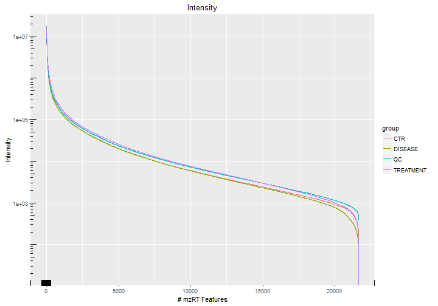
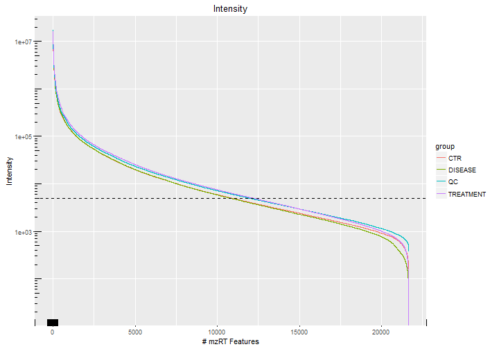
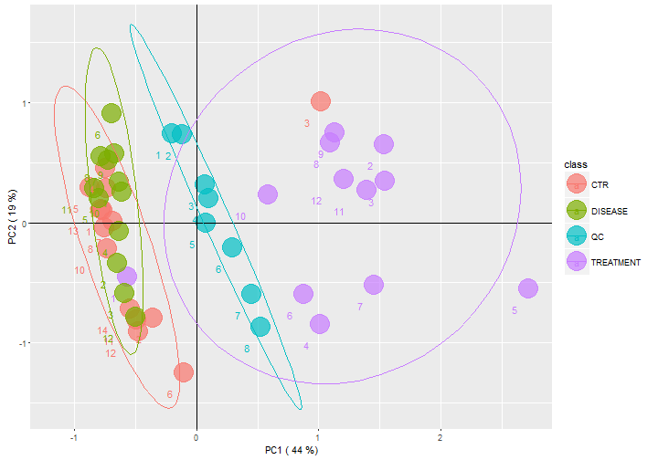
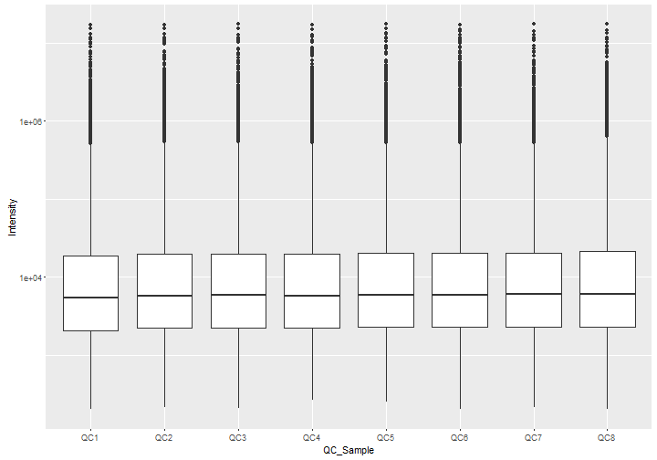
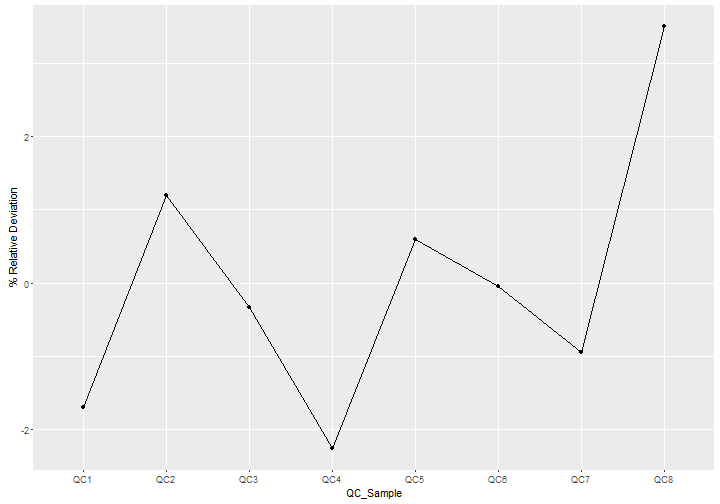

Untargeted metabolomics data analysis tutorial
========================================================

#### This tutorial is based on *Feature-oriented mass-spectrometry based metabolomics data analysis LC/MS(qTOF) Data Analysis Using XCMS* by *Maria Vinaixa*

This hands-on tutorial illustrates the approach currently used in our research group to conveniently rank XCMS detected mzRT metabolic features for further MS/MS identification experiments.

Nowadays, feature-oriented mass-spectrometry based metabolomics experiments lead to routinely monitor thousands of mzRT features (i.e., peaks corresponding to individual ions with a unique mass-to-charge ratio (m/z) and a unique retention time (RT)). Each mzRT feature in the dataset is associated with an intensity value (or area under the peak), which indicates its relative abundance in the the biological sample.

In summary the data analysis pipeline for feature-oriented mass-spectrometry based metabolomics is:

1. Raw LC/MS data Organization and Conversion  
  * Scans recorded by the instrument are saved in a vendor data format. Storing various information, for example: ionization mode, retention time, m/z values detected and their corresponding intensity.  
  * Vendor data formats need to be converted to mzXML or mzML  
  * The most common tool is _msconvert_ by _Proteowizard_  
2. XCMS preprocessing  
  * Peak picking (`xcmsSet()`): Analyze the retention time profile of recorded m/z scans and find Gaussian-like peaks time-wise. This functions processes each sample independently and performs peak quantification.   
  * Retention time correction (`retcor()`): Unfortunately, chromatography and mass-spectrometry are not perfectly stable over time. Thus, the retention time values are aligned to make ion peaks comparable between different samples.   
  * Peak grouping (`group()`): Transform ion peaks to _features_. Group ion peaks with a similar retention time and m/z values across samples. This results in a unique value of m/z and retention time (mzRT feature) for different peaks that will be used to compare sample groups.
  * NA value imputation (`fillPeaks()`): If a feature intensity/area value is missing in any sample group, this function imputes an intensity value. After peak grouping, there will always be peak groups that do not include peaks from every sample. This method produces intensity values for those missing samples by integrating raw data in peak group region.
  * If you want to learn more about `xcms`, please check:
      + `xcms` vignette: `vignette("xcmsPreprocess")`
      + [workflow4metabolomics xcms material](http://workflow4metabolomics.org/sites/workflow4metabolomics.org/files/files/w4e-2016-MSprocessing_LC-MS.pdf)
3. Feature matrix data analysis
  * Feature filtering
  * Statistical testing
  * Feature ranking. it is essential to prioritize the list of those detected mzRT features (molecular ions) that will be subsequently submitted to MS/MS experiments to further confirm their identity.This
4. From features to compound identifications
  * Feature annotation: It is important to state that detection of a mzRT feature does not necessary translate into a metabolite entity. Usually, the number of mzRT features is greatly inflated due to the recurrent detection of adducts ([M + Na]+, [M + K]+, etc), isotopes, or doubly charged ions. Several recently launched open-source algorithms, such as CAMERA, and commercially available software such as Mass Hunter (Agilent Technologies) or Sieve (Thermo Scientific), among others are capable of filtering redundancy by annotating isotopes and adduct peaks. 
  This step is not compulsoray and is currently one of the main challenges in untargeted metabolomics data analysis.
  * Database matching: Features that pass statistical significance are considered candidate metabolites that explain the differences found. To identify them, we require using a list of possible adducts and database that represents (as well as possible) the metabolite matrix we should expect in our samples. Though, a database match represents just a putative metabolite identity assignment, we require further experiments to confirm that identification.
  Some examples of metabolites databases:
      + [Human metabolome database](http://hmdb.ca)
      + [Massbank](http://www.massbank.jp/)
      + [Metlin](https://metlin.scripps.edu/)
  * MS/MS experiments: Retention time confirmation and/or MS/MS fragmentation of a model pure compound to that from the ion of interest is necessary to uniquivocally identify metabolites. See [Metabolomics Standard Initiative](http://www.metabolomics-msi.org/).

---------------------------------------------------------

This tutorial assumes that you have a working R installation and the following R packages installed.


```r
library(xcms)
library(ggplot2)
library(reshape)
```

In this tutorial we will use the data that can be found at [Metabolights-MTBLS103](https://www.ebi.ac.uk/metabolights/MTBLS103) LC-MS (Reverse Phase-C18 ESI+ mode) dataset.

Since `xcms` preprocessing is a time consuming process, I provide an *.RData* file that already includes the xcmsSet object.


```r
load("./data/xset3.Rdata")
xset3
```

```
An "xcmsSet" object with 46 samples

Time range: 2.4-1260.2 seconds (0-21 minutes)
Mass range: 100-999.7262 m/z
Peaks: 2907954 (about 63216 per sample)
Peak Groups: 51908 
Sample classes: CTR, DISEASE, QC, TREATMENT 

Profile settings: method = bin
                  step = 0.1

Memory usage: 266 MB
```


```r
phenoData(xset3)
```

```
              class
CTR1            CTR
CTR2            CTR
CTR3            CTR
CTR4            CTR
CTR5            CTR
CTR6            CTR
CTR7            CTR
CTR8            CTR
CTR9            CTR
CTR10           CTR
CTR11           CTR
CTR12           CTR
CTR13           CTR
CTR14           CTR
TREATED1  TREATMENT
TREATED2  TREATMENT
TREATED3  TREATMENT
TREATED4  TREATMENT
TREATED5  TREATMENT
TREATED6  TREATMENT
DISEASE1    DISEASE
DISEASE2    DISEASE
DISEASE3    DISEASE
DISEASE4    DISEASE
DISEASE5    DISEASE
DISEASE6    DISEASE
TREATED7  TREATMENT
TREATED8  TREATMENT
TREATED9  TREATMENT
TREATED10 TREATMENT
TREATED11 TREATMENT
TREATED12 TREATMENT
DISEASE7    DISEASE
DISEASE8    DISEASE
DISEASE9    DISEASE
DISEASE10   DISEASE
DISEASE11   DISEASE
DISEASE12   DISEASE
QC1              QC
QC2              QC
QC3              QC
QC4              QC
QC5              QC
QC6              QC
QC7              QC
QC8              QC
```

## Feature filtering

### Sample Representativeness in each mzRT feature

First, we would like to retain those mzRT features wich are consistently found in a majority of samples in
a group. The 80% rule is commonly accepted, meaning that to further consider a mzRT feature it
should be consistently found in 80% of samples of at least one of the experimental groups.


```r
# Determine the number of samples per group
table(xset3@phenoData)
```

```

      CTR   DISEASE        QC TREATMENT 
       14        12         8        12 
```

```r
# Calculate the 80% of samples in each experimental group
round(table(xset3@phenoData) * 0.8, 0)
```

```

      CTR   DISEASE        QC TREATMENT 
       11        10         6        10 
```

```r
group.80 <- round(table(xset3@phenoData) * 0.8, 0)
```


```r
# Obtain the mzRT table
mygroups <- data.frame(xset3@groups)
rownames(mygroups) <- groupnames(xset3)
# Restrict to features found in at least 80% of samples in a group
group.filter <- which(mygroups$CTR >= group.80["CTR"] | mygroups$DISEASE >= 
    group.80["DISEASE"] | mygroups$TREATMENT >= group.80["TREATMENT"])
# Calculate percentage
(length(group.filter)/nrow(mygroups)) * 100
```

```
[1] 41.7296
```

### Intensity

The accuracy of a metabolite identification depends on the quality of fragmentation patterns generated during the MS/MS experiments. MS/MS experiments should focus on parent ions with a minimum intensity threshold to ensure suitable MS/MS fragmentation spectra recording. This threshold depends on the experimental conditions, mainly it depends on the instrument.


```r
# Get intensities from xcmsSet object from those features meeting 80% rule
X1 <- groupval(xset3, value = "maxo")
X1 <- X1[group.filter, ]
# Get names of mzRT features (M + rounded mz + T + rounded RT)
rownames(X1) <- groupnames(xset3)[group.filter]
X1[1:5, 1:10]
```

```
               CTR1        CTR2      CTR3        CTR4       CTR5
M100T59    2975.049    4625.867   2699.00    2503.867   2809.758
M100T289 354543.500 1135338.000 939965.50 1058408.125 253488.109
M100T264  22569.812   13504.381  21812.15   17410.385  27320.783
M100T955  65744.836   60260.648  53662.90   52819.184  60640.914
M100T278 158100.172  187088.234 299632.31  117444.750 246673.656
               CTR6       CTR7        CTR8       CTR9       CTR10
M100T59    4561.966   3290.282    3153.687   2839.852    3144.219
M100T289 688560.375 371865.812 2850613.750 793267.438 1692838.500
M100T264  15561.097  17909.021   22832.283  24214.775   24267.422
M100T955  28040.297  52233.258   62972.840  58235.973   61929.402
M100T278 152977.703 122047.977  244248.844 250127.406  162095.562
```


```r
# Define experimental groups
myclass <- as.factor(xset3@phenoData$class)
table(myclass)
```

```
myclass
      CTR   DISEASE        QC TREATMENT 
       14        12         8        12 
```

This plot shows the intensity profiles of each sample group, as we can see they are comparable between all groups. 


```r
# Compute the mean intensities for each group
meanintensities <- t(apply(X1, 1, function(x) tapply(x, myclass, mean)))
rownames(meanintensities) <- rownames(X1)

## Plot Intensity distributions /density plots

# For the first plot we need to sort mean intensities in each group
M2 <- apply(meanintensities, 2, sort, decreasing = TRUE)
M2plot <- melt(M2)
names(M2plot) <- c("Features", "group", "Intensity")

# Plot intensities profile
ggplot(data = M2plot, aes(x = Features, y = Intensity, colour = group)) + geom_line() + 
    scale_y_log10() + labs(y = "Intensity", x = "# mzRT Features", title = "Intensity") + 
    annotation_logticks()
```



If we take a look at the plot of the distribution of intensity, we can observe that there is a large number of ions that have about XXX units/counts of intensity, this we could call it the "background", which includes noise and low intensity peaks, we are not interested in these peaks.

```r
ggplot(data = M2plot, aes(x = Features, y = Intensity, colour = group)) + geom_line() + 
    geom_hline(yintercept = 5000, linetype = 2) + scale_y_log10() + labs(y = "Intensity", 
    x = "# mzRT Features", title = "Intensity") + annotation_logticks()
```




Based on our experience with the similar experiments and seeing that most of the peaks have large intensity we decide to set the minimum intensity at 5000.


```r
# Stablish intensity threshold value
thresholdvalue <- 5000
# Getting number of features with mean intensity above certain threshold
# counts in at least one of the groups except QC group
intensity.filter <- meanintensities[, which(colnames(meanintensities) != "QC")]
idx_i <- rownames(meanintensities[apply(intensity.filter, 1, function(x) any(x > 
    thresholdvalue) == TRUE), ])
# Getting the percentage out of the total mzRT features meeting the
# intensity threshold
(length(idx_i)/nrow(meanintensities)) * 100
```

```
[1] 61.34066
```

### Handling analytical variation through Quality Control Samples (QCs)

The most common source of variation in LC-MS experiments are due to sample preparation (human variation) and instrumental deviation during the chromatography run (analytical variation).

The ideal method to examine analytical variation is to analyze quality control (QC) samples, which will provide robust quality assurance of each detected mzRT feature. To this end, QC samples should be prepared by pooling aliquots of each individual sample entering the study and analyze them periodically throughout the sample work list. Being replicates of the same pooled samples, QC samples are expected to not contain biological variation.

A powerful tool to examine sources of variation in a dataset is principal components analysis (PCA). PCA is a very popular unsupervised multivariate technique for exploration and reduction of high-dimensional data. PCA basically summarizes the variation in the original dataset to a set of uncorrelated components, each of which is a particular linear combination of the original variables. It is always advisable to perform a preliminary exploratory PCA analysis on a the dataset including both, biological samples and QC samples. This will reveal unestimable information of main patterns and trends within the dataset. The performance of the analytical platform can be calculated individually for each detected mzRT feature computing the variation of each mzRT feature around their mean in QC pooled samples.


```r
## Compute and plot PCA for QCs check and to explore main trends in the data

## 1-. Create a dataframe containing intensity data
D1 <- data.frame(X1)
## 2-. Restrict this dataframe to intensities above the fixed threshold value
D1 <- D1[idx_i, ]
## 3-. Row-wise normalzation prior to PCA: Normalize across samples each mzRT
## variable to max=1
D1norm <- data.frame(t(apply(D1, 2, function(x) (x/max(x)))))
## 4-. Compute PCA
pca <- prcomp(D1norm)
## 5-. Print variance summary for the fourth first PCs
summary(pca)$importance[, 1:4]
```

```
                             PC1       PC2       PC3      PC4
Standard deviation     0.8878878 0.5744142 0.3687736 0.362704
Proportion of Variance 0.4422200 0.1850800 0.0762800 0.073790
Cumulative Proportion  0.4422200 0.6273000 0.7035800 0.777380
```

```r
## 6-. Get scores values
scores <- data.frame(pca$x[, c("PC1", "PC2")])
scores$class <- myclass
## 7-. Labelling samples
lab <- as.numeric(gsub("\\D", "", colnames(D1)))
# 7-. Plot scores
scores.plot <- ggplot(data = scores, aes(x = PC1, y = PC2, colour = class)) + 
    geom_point(alpha = I(0.7), size = 10) + geom_text(data = scores, mapping = aes(x = PC1, 
    y = PC2, label = lab), size = 4, vjust = 3, hjust = 3) + geom_hline(yintercept = 0) + 
    geom_vline(xintercept = 0) + xlab(paste("PC1 (", round(summary(pca)$importance[2, 
    1], 2) * 100, "%)")) + ylab(paste("PC2 (", round(summary(pca)$importance[2, 
    2], 2) * 100, "%)")) + stat_ellipse()

scores.plot
```



Examine analytical variation in the dataset using PCA. Determine the percentage of features having more analytical variation than other sources of variation. 

Explore the xcmsSet object using PCA analysis. Represent PCA scores plot and try to interpret it. Do you think that the clustering trend of QC samples is as it should?. Is there any rationale? According to the injection sequence of QC samples, was there any analytical drift during sample acquisition?

### Diagnosing QC Samples

What if we observe an unexpected QC behaviour? QCs are our source of information in terms of instrument variability along the LC-MS run. In case we detect that QCs positioning in the PCA seems to depend on the injection order, we can use the following plots to check if the data itself can reveal us what or when it happened.

*QC intensity boxplots.* Boxplots provide a general view of the distribution of values in our QC samples, independently of feature. We expect them to be near exact to each other.


```r
M3 <- X1[, which(myclass == "QC")]
M3plot <- data.frame(melt(M3))
colnames(M3plot) <- c("Features", "QC_Sample", "Intensity")

p3 <- ggplot(M3plot, aes(x = QC_Sample, y = Intensity)) + geom_boxplot() + scale_y_log10()

p3
```

```
Warning: Removed 212 rows containing non-finite values (stat_boxplot).
```



*QC total intensity.* QC total sum of ions intensity, in other words, the total of signal recorded should be comparable between QCs. If we observe that there is a large deviation at some point, or that there is a linear or non-linear tendency to gain/lose intensity, we may have to use a method for signal correction. Signal correction is a delicate approach, and a few different methods exist (LOESS, LOWESS, RSLC), they perform mathematical approximations with the intention to make the QC signal profile as uniform as possible, and then interpolate these calculations to the sample values as well.

```r
totalI <- apply(M3, 2, sum)
M3plot2 <- data.frame(QC_Sample = names(totalI), TotalIntensity = totalI)
M3plot2$TotalIntensity <- (M3plot2$TotalIntensity - mean(M3plot2$TotalIntensity)) * 
    100/mean(M3plot2$TotalIntensity)
p4 <- ggplot(M3plot2, aes(x = QC_Sample, y = TotalIntensity, group = 1)) + geom_point() + 
    geom_line() + ylab("% Relative Deviation")

p4
```



*QC retention time shifts.* Given that chromatography systems are becoming more and more stable, the fact that retention time would vary during the LC-MS run is a rare phenomenon. In the chance that it occurred, the coefficient of variation (CV) at a given retention time window would be notably larger than the rest of the run.

```r
# Define (CV) function
co.var <- function(x) (100 * sd(x)/mean(x))
qc.var <- apply(M3, 1, co.var)
qc.RT <- mygroups[names(qc.var), "rtmed"]
M5plot <- data.frame(RT = qc.RT, IntensityCV = qc.var)

p5 <- ggplot(M5plot, aes(x = RT, y = IntensityCV)) + geom_line()
p5
```


Once assured that there is not a major reason for signal correction or repeating our experiment, it is time to continue with feature filtering and statistical analysis.


### Compute CV across samples and QCs

The performance of the analytical platform can be calculated individually for each detected mzRT feature computing the variation of each mzRT feature around their mean in QC pooled samples (CVQC). Likewise, we can also calculate the variation of mzRT features around their mean in the samples entering the experiment (CVS). This variation would enclose both, analytical and biological variation.

Consequently, those mzRT features where CVQC > CVS contain more analytical variation than other sources of variation and they should be conveniently removed from further analysis. This criteria helps to focus on mzRT features with the lowest proportion of analytical variation.

Finally combine intensity and QC criteria to reduce the initially detected number of mzRT features.


```r
# Define QC and Sample samples classes
cl1 <- rep(c("Sample", "QC"), times = c(38, 8))
# Compute CV for QC and Samples
CV <- t(apply(X1, 1, function(x) tapply(x, cl1, co.var)))
# Determine the percentage of features where CV(Samples)>CV(QC)
idx_qc <- rownames(CV)[CV[, "Sample"] > CV[, "QC"]]
length(idx_qc)/nrow(X1) * 100
```

```
[1] 78.22815
```


```r
cat("Number of features that pass Intensity filter:", length(idx_i))
```

```
Number of features that pass Intensity filter: 13287
```

```r
cat("Number of features that pass CV filter:", length(idx_qc))
```

```
Number of features that pass CV filter: 16945
```


```r
# Combine both intensity and QC criteria
Ib <- intersect(idx_i, idx_qc)
# Calculate the number of retained mzRT features
cat("Number of features that pass both filters:", length(Ib))
```

```
Number of features that pass both filters: 10075
```

```r
length(Ib)/nrow(X1) * 100
```

```
[1] 46.51216
```


## Statistical Analysis


```r
# Create a new dataset without QC samples and with those mzRT features
X1 <- t(data.frame(X1))
D2 <- subset(X1, myclass != "QC", select = Ib)
D2 <- data.frame(t(D2))
D2[1:4, 1:5]
```

```
               CTR1        CTR2       CTR3        CTR4      CTR5
M100T289  354543.50 1135338.000 939965.500 1058408.125 253488.11
M100T264   22569.81   13504.381  21812.154   17410.385  27320.78
M100T278  158100.17  187088.234 299632.312  117444.750 246673.66
M100T85_2  12164.73    7000.435   7913.676    9574.175  12948.65
```

Provided the limitation in the number of MS/MS confirmation experiments that can be run, additional criteria to those described above are necessary to further reduce the number of initial mzRT features to an amenable number. 

In our pipeline once QC and intensity criteria has been applied, the resulting dataset is usually interrogated via hypothesis testing to select mzRT features showing statistical significance. It is important to note that datasets derived from feature-oriented mass-spectrometry based metabolomics are both high-dimensional and multicollinear. We are presented with datasets containing thousands of detected mzRT with a rather limited number of individuals or samples per group. Additionally, these features present multiple correlations since a metabolite is usually represented by more than one mzRT feature resulting from isotopic distributions, potential adducts, and in-source fragmentation. Moreover, the evident biochemical interrelation among metabolites may also contribute to the redundancy. 

In untargeted LC-MS-based metabolomics studies, the number mzRT features tested in a univariate manner ranges in the thousands. As the number of hypotheses tests increases, so does the probability of wrongly rejecting a null hypothesis because of random chance and therefore a substantial number of false positives (Type I error) may occur. This accumulation of false positives is termed the *multiple testing problem* and is a general property of a confidence-based statistical test when applied across multiple variables. 

From a metabolomics research standpoint, Type I errors are particularly undesirable. A substantial amount of work and resources are required to setup MS/MS confirmation experiments. In the worst case, a follow-up validation study on a false positive finding would not replicate the original work with consequent waste of resources and time. In such situations the chance for false positive rates must be carefully handed and therefore, it is necessary to correct for multiple testing. 


```r
# Get rid out of QCs in factor defining experimental groups
myclass <- as.factor(xset3@phenoData$class[xset3@phenoData$class != "QC"])
# Perform an anova comparison of groups (CTR, DISEASE & TREATMENT)
pm <- matrix(ncol = length(levels(myclass)), nrow = nrow(D2))
for (i in 1:nrow(D2)) {
    tempdata <- data.frame(value = as.numeric(D2[i, ]), class = myclass)
    aov.out <- aov(value ~ class, data = tempdata)
    multcomp <- TukeyHSD(aov.out)
    pm[i, ] <- as.matrix(multcomp[["class"]][, "p adj"])
}
rownames(pm) <- rownames(D2)
colnames(pm) <- rownames(multcomp[["class"]])
# Adjust for multiple testing using false discovery rate
p.val.adj.DISEASE.CTR <- p.adjust(pm[, "DISEASE-CTR"], "fdr")
p.val.adj.TREATMENT.DISEASE <- p.adjust(pm[, "TREATMENT-DISEASE"], "fdr")
```

In addition to statistical significance, a common practice to identify mzRT features of relevance within a dataset is to rank these features according their fold-change (FC). FC is the ratio of intensity between two conditions, normally taking the control case as a reference, and it can be thought as the magnitude of change calculated between two populations under study.


```r
# Create the fold change function
fc.test <- function(df, classvec, classA, classB) {
    coln <- names(df)
    case <- df[which(coln == classA)]
    control <- df[which(coln == classB)]
    logFC <- log2(case/control)
    FC <- case/control
    FC2 <- -control/case
    FC[FC < 1] <- FC2[FC < 1]
    fc.res <- c(FC, logFC)
    names(fc.res) <- c("FC", "logFC")
    return(fc.res)
}
```


```r
# Calculate mean intensities
meanintensities <- t(apply(D2, 1, tapply, myclass, mean))

# Calculate FC for 'DISEASE-CTR' groups
fc.res <- t(apply(meanintensities, 1, function(x) fc.test(x, myclass, "DISEASE", 
    "CTR")))
hist(fc.res[, "logFC"], breaks = 100)
```


We may be more or less restrictive depending on the number of significant features found. In our case, we set the FC threshold to *2*. 


```r
# Calculate FC for 'DISEASE-CONTROL' groups
R1 <- data.frame(fc.res, p.val.adj.DISEASE.CTR)
I.DISEASE.TREATMENT <- (abs(R1$FC) > 2 & R1$p.val.adj.DISEASE.CTR < 0.05)
R1$threshold <- as.factor(I.DISEASE.TREATMENT)
table(R1$threshold)
```

```

FALSE  TRUE 
 9815   260 
```


```r
# Calculate FC for 'DISEASE-TREATMENT' groups
fc.res2 <- t(apply(meanintensities, 1, function(x) fc.test(x, myclass, "TREATMENT", 
    "DISEASE")))
R2 <- data.frame(fc.res2, p.val.adj.TREATMENT.DISEASE)
I.DISEASE.CTR <- (abs(R2$FC) > 2 & R2$p.val.adj.TREATMENT.DISEASE < 0.05)
R2$threshold <- as.factor(I.DISEASE.CTR)
table(R2$threshold)
```

```

FALSE  TRUE 
 7233  2842 
```


Examine difeerences derived from CTR, TREATMENT and DISEASE states in the example dataset using Volcano Plot. Which comparison shows the highest diferences?

```r
# Draw Volcano plots for both comparisons
p1 <- ggplot(data = R1, aes(x = R1$logFC, y = -log10(R1$p.val.adj.DISEASE.CTR), 
    colour = threshold)) + geom_point(alpha = 0.4, size = 1.75) + theme(legend.position = "none") + 
    xlim(-10, 10) + geom_hline(yintercept = -log10(0.05)) + geom_vline(xintercept = log2(2)) + 
    geom_vline(xintercept = -log2(2)) + labs(x = "log2(FC)", y = "-log10(p.adj)", 
    title = "DISEASE vs CTR")
p2 <- ggplot(data = R2, aes(x = R2$logFC, y = -log10(R2$p.val.adj.TREATMENT.DISEASE), 
    colour = threshold)) + geom_point(alpha = 0.4, size = 1.75) + theme(legend.position = "none") + 
    xlim(-10, 10) + geom_hline(yintercept = -log10(0.05)) + geom_vline(xintercept = log2(2)) + 
    geom_vline(xintercept = -log2(2)) + labs(x = "log2(FC)", y = "-log10(p.adj)", 
    title = "DISEASE vs TREATMENT")

p1
```


```r
p2
```

```
Warning: Removed 4 rows containing missing values (geom_point).
```


## Collapse Relevant Information to subsequent MS/MS experiments

The final step in an untargeted metabolomics experiment is the identification of the features of interest, features that may explain the differences between our sample groups. This list of features are then searched in a metabolite database looking for matches. 

There are two main concepts to take into account when performing this search:
* Adducts: During ionisation in the mass-spectrometer, compound ions and solvent ions (such as K+ or Na+) may become bound due to ionic interactions, meaning that the m/z of the feature is different of the monoisotopic mass of the non-ionised compound. Thus, a list of adducts and their corresponding mass shifts are required to interrogate the database.
* Mass accuracy error: Due to electronic limitations mass-spectrometers cannot measure the m/z perfectly, meaning that there is an amount of inexactitude in the m/z values in the features. This mainly depends on the type of mass-spectrometer and technical aspects (calibration and state of the instrument). In consequence, a PPM has to be considered when searching for matches in the database.

Collect all necessary information to subsequent MS/MS experiments and summarize it in a ".csv" file.


```r
# Combine FC values as a criteria to sort features
idx.s <- union(which(I.DISEASE.TREATMENT), which(I.DISEASE.CTR))
# This step is useful to rank fold-changes if there is more than 1 sample
# group
FC.combi <- abs(R1$FC * R2$FC)
Rf <- data.frame(R1, R2, FC.combi)
Rf.s <- Rf[idx.s, ]
# sort fold change values
Rf.s.ord <- Rf.s[order(Rf.s$FC.combi, decreasing = TRUE), ]
sig.ord <- rownames(Rf.s.ord)
# Retrieving mzRT information
final <- mygroups[sig.ord, c("mzmed", "rtmed")]
# Getting mean group intensities for significative features
intord <- meanintensities[sig.ord, ]
# Collapse all information
feature.msms <- data.frame(final, Rf.s.ord, intord)
dim(feature.msms)
```

```
[1] 2853   14
```

```r
head(feature.msms)
```

```
              mzmed   rtmed        FC     logFC p.val.adj.DISEASE.CTR
M736T472   736.4704 472.479 -142.0258 -7.150009                     1
M692T469   692.4445 469.046 -134.9187 -7.075947                     1
M648T465   648.4179 465.035 -137.5795 -7.104122                     1
M399T475   399.2661 475.372 -124.3423 -6.958173                     1
M649T465   649.4212 465.041 -115.0380 -6.845967                     1
M369T472_1 368.7395 472.167 -105.7569 -6.724608                     1
           threshold      FC.1   logFC.1 p.val.adj.TREATMENT.DISEASE
M736T472       FALSE 1114.3114 10.121937                3.003738e-05
M692T469       FALSE 1127.6202 10.139066                2.178031e-05
M648T465       FALSE 1078.6011 10.074946                2.697975e-05
M399T475       FALSE 1072.6970 10.067027                1.203989e-05
M649T465       FALSE  897.7880  9.810231                2.754086e-05
M369T472_1     FALSE  895.4665  9.806496                1.599099e-05
           threshold.1  FC.combi       CTR   DISEASE TREATMENT
M736T472          TRUE 158260.96  44256.34  311.6078  347228.1
M692T469          TRUE 152137.07  94143.45  697.7790  786829.7
M648T465          TRUE 148393.41 185312.94 1346.9516 1452823.4
M399T475          TRUE 133381.60 126067.57 1013.8753 1087581.0
M649T465          TRUE 103279.75  58230.38  506.1838  454445.8
M369T472_1        TRUE  94701.77  41988.29  397.0265  355523.9
```

```r
# Write it in a .csv file
write.csv(file = "resultstoMSMS.csv", x = feature.msms)
```

There is two options when performing your putative identification search against metabolite databases:
* Perform batch searches in METLIN or HMDB. Where you have to load a list of m/z values and select from a list of adducts and define a PPM error.
+ The database is always up-to-date
- "Limited" number of adducts
* Download (or build your own) a database and perform the search programmatically.
+ Flexibility
+ Any adducts can be search (in-house list of adducts)
- Needs to be updated

#How to download HMDB database:  
Go to [hmdb.ca](http://hmdb.ca)  
Browse Metabolites > Extract data > Apply filters if necessary > Select columns (Name, monoisotopic mass) > Download

## Search our mzRT into a downloaded database

This simple function will perform a search into our downloaded HMDB database. Here, we are using the most common adducts, remember that there is multiple types of adducts, and depending on the mobile phases some may be expected or not.


```r
# files with adducts masses
negative <- read.table("./data/Negative_ESI.txt", header = T, stringsAsFactors = F)
positive <- read.table("./data/Positive_ESI.txt", header = T, stringsAsFactors = F)
# HMDB database
hmdb <- read.table("./data/HMDB_17_09.txt", header = T, sep = "\t", stringsAsFactors = F, 
    fill = T, quote = "")

# list of significant features' m/z
input <- feature.msms$mzmed
# ppm error to perform the search. Instrument dependant (e.g. orbitrap 2-6;
# qTOF 8-12)
ppm <- 10

hmdbhits <- lapply(input, function(x) {
    search_vect <- (x + positive$AdductMass)  # here we are using positive ionisation
    h <- lapply(search_vect, function(x) {
        mass_range <- c(x - ppm * (x/1e+06), x + ppm * (x/1e+06))
        a <- which(hmdb$MonoisotopicMass > mass_range[1] & hmdb$MonoisotopicMass < 
            mass_range[2])
    })
    
    h2 <- sapply(1:length(h), function(x) {
        y <- h[[x]]
        if (length(y) > 0) {
            r <- paste(hmdb$Name[y], sep = "", collapse = ";")
        } else {
            r <- "No hit"
        }
        return(r)
    })
    
    return(h2)
})

hmdbhits <- do.call("rbind", hmdbhits)
colnames(hmdbhits) <- positive$Adduct
head(hmdbhits)
```

```
     M+H      M+NH4    M+Na                         
[1,] "No hit" "No hit" "No hit"                     
[2,] "No hit" "No hit" "No hit"                     
[3,] "No hit" "No hit" "No hit"                     
[4,] "No hit" "No hit" "10'-Apo-beta-caroten-10'-al"
[5,] "No hit" "No hit" "Peltatol B;Peltatol A"      
[6,] "No hit" "No hit" "No hit"                     
     M+K                                                                                                                                                                                                                                                                                                                                            
[1,] "PE(18:3(6Z,9Z,12Z)/P-16:0);PE(18:3(9Z,12Z,15Z)/P-16:0);PE(P-16:0/18:3(6Z,9Z,12Z));PE(P-16:0/18:3(9Z,12Z,15Z))"                                                                                                                                                                                                                                
[2,] "No hit"                                                                                                                                                                                                                                                                                                                                       
[3,] "No hit"                                                                                                                                                                                                                                                                                                                                       
[4,] "Tetracosatetraenoic acid (24:4n-6);1-Hydroxy-1-phenyl-3-octadecanone"                                                                                                                                                                                                                                                                         
[5,] "DG(14:1(9Z)/22:6(4Z,7Z,10Z,13Z,16Z,19Z)/0:0);DG(18:3(6Z,9Z,12Z)/18:4(6Z,9Z,12Z,15Z)/0:0);DG(18:3(9Z,12Z,15Z)/18:4(6Z,9Z,12Z,15Z)/0:0);DG(18:4(6Z,9Z,12Z,15Z)/18:3(6Z,9Z,12Z)/0:0);DG(18:4(6Z,9Z,12Z,15Z)/18:3(9Z,12Z,15Z)/0:0);DG(22:6(4Z,7Z,10Z,13Z,16Z,19Z)/14:1(9Z)/0:0);DG(14:1n5/0:0/22:6n3);DG(18:3n6/0:0/18:4n3);DG(18:3n3/0:0/18:4n3)"
[6,] "No hit"                                                                                                                                                                                                                                                                                                                                       
     M+H-H2O             M+H-2H2O
[1,] "No hit"            "No hit"
[2,] "Fasciculic acid C" "No hit"
[3,] "No hit"            "No hit"
[4,] "No hit"            "No hit"
[5,] "No hit"            "No hit"
[6,] "No hit"            "No hit"
```

*****
*****

Untargeted isotope labelling analysis with geoRge
========================================================

# Labelling experiments in metabolomics

The use of stable isotope compounds in metabolism experiments has been an strategy to enlight the way enzymes perform their role and how metabolites are transformed. In general, the sources of labelling are metabolites that are essential for cell metabolism, such glucose, glutamine or glycerol. This labeled metabolites are used in cell culturing instead of their non-labeled homologous for a limited amount of hours. The labelled metabolites then are incorporated and metabolized as needed, distributing their labelled atoms through the metabolic pathways.

Isotopic labelling in metabolomics allows the interrogation of the metabolism fluxes, the amount of metabolic reactions performed per time, this is accomplished by measuring the amount of labeled derivates of a compopund (isotopologues), either in absolute concentrations (targeted methods) or in a relative manner (untargeted). Isotopologues, are compounds with the same chemical formula, i.e. identity, but different mass due to divergent atom composition.

## geoRge, a tool for isotope labelling untargeted metabolomics experiments.

As seen above, the large number of features obtained during an untargeted metabolomics experiment has to be addressed by making assumptions and filtering to reduce our number of features in our dataset. 

The main objective in this type of approaches is to determine which clusters of features belong to labelled isotopologues of the same metabolite, the number of atoms of their structure are labelled and the amount of labelling they experienced.

There is a variety of tools that can be used for isotope labelling untargeted metabolomics data analysis, each using its own algorithm and thus different advantages and disadvantages, in terms of speed, sensibility, sensitivity and number of samples necessary to run.

In the case of geoRge, we assume that labelled isotopologues are equivalent to "significant features" when comparing non-labelled and labeled samples, thus they are detectable using a similar workflow as we saw in the former part of this document, by performing statistical and fold-change testing. In consequence, the main drawback of this approach is that the detection of labelled features depends on the statistical power of the experimental design, i.e. number of replicates and replicate CV.

## geoRge pipeline

geoRge is currently only available in [GitHub](https://github.com/jcapelladesto/geoRge), so in this case we need to install the package using **devtools**.

```r
#install.packages("devtools", dependencies=TRUE)
library(devtools) 

install_github("jcapelladesto/geoRge")
```

The package itself contains an example **xcmsSet** from [Metabolights-213](https://www.ebi.ac.uk/metabolights/MTBLS213) .


In our case the dataset contains a collection of non-labelled samples and labelled samples were cultured in glucose with its 6 carbons labelled with its C13 isotope which weights 13.003 instead of 12.000 and there is two sample classes, normoglycemic and hyperglycemic (normal and high glucose concentration), 3 replicates each.


```r
mtbls213@phenoData
```

```
                                         class
CELL_Glc12_05mM_Normo_04 CELL_Glc12_05mM_Normo
CELL_Glc12_05mM_Normo_05 CELL_Glc12_05mM_Normo
CELL_Glc12_05mM_Normo_06 CELL_Glc12_05mM_Normo
CELL_Glc12_25mM_Normo_16 CELL_Glc12_25mM_Normo
CELL_Glc12_25mM_Normo_17 CELL_Glc12_25mM_Normo
CELL_Glc12_25mM_Normo_18 CELL_Glc12_25mM_Normo
CELL_Glc13_05mM_Normo_01 CELL_Glc13_05mM_Normo
CELL_Glc13_05mM_Normo_02 CELL_Glc13_05mM_Normo
CELL_Glc13_05mM_Normo_03 CELL_Glc13_05mM_Normo
CELL_Glc13_25mM_Normo_13 CELL_Glc13_25mM_Normo
CELL_Glc13_25mM_Normo_14 CELL_Glc13_25mM_Normo
CELL_Glc13_25mM_Normo_15 CELL_Glc13_25mM_Normo
```

The first function, **PuInc_seeker** (Putative incoporation) performs a comparison between labelled and non-labelled sample groups. The user can provide as many groups as desired, as long as, there is both labelled and non-labelled samples.


```r
s1 <- PuInc_seeker(XCMSet = mtbls213, ULtag = "CELL_Glc12", Ltag = "CELL_Glc13", 
    sep.pos.front = TRUE, fc.threshold = 1.5, p.value.threshold = 0.05)
```

The second function, **basepeak_finder** will try to match each labelled feature with its corresponding monoisotopic (not labelled) m/z, thus giving the m/z that can be matched to the metabolite entity. 


```r
s2 <- basepeak_finder(PuIncR = s1, XCMSet = mtbls213, UL.atomM = 12, L.atomM = 13.003355, 
    ppm.s = 6.5, Basepeak.minInt = 2000)
```

If there is more than one group in the experiment, we can compare the labelling between 2 groups using **label_compare()** function:


```r
s3 <- label_compare(geoRgeR = s2, XCMSet = mtbls213, rt.win.min = 1, control.cond = "05mM_Normo", 
    ppm.s = 6.5, fc.vs.Control = 1, p.value.vs.Control = 0.05, Show.bp = T)
```


The package also includes an internal database and a list of most common adducts. The function **database_query()** can be used to directly match the monoisotopic peak of labelled features.


```r
negative <- read.table(system.file("extdata/adducts_negative.txt", package = "geoRge"), 
    header = T, stringsAsFactors = F)

db <- read.csv(system.file("extdata/ExampleDatabase.csv", package = "geoRge"), 
    header = T, stringsAsFactors = F, fill = T)

hits <- database_query(geoRgeR = s2, adducts = negative, db = db)

head(hits)
```

```
  M-H                                                                                                                                                                                                                                                                                                                                                                                                                      
1 "3-Furoic acid;2-Furoic acid;3-Hydroxy-2H-pyran-2-one;2,3-Dihydroxy-2,4-cyclopentadien-1-one"                                                                                                                                                                                                                                                                                                                            
2 ""                                                                                                                                                                                                                                                                                                                                                                                                                       
3 "L-Proline;D-Proline;Acetamidopropanal;4-Amino-2-methylenebutanoic acid;Pterolactam"                                                                                                                                                                                                                                                                                                                                     
4 ""                                                                                                                                                                                                                                                                                                                                                                                                                       
5 ""                                                                                                                                                                                                                                                                                                                                                                                                                       
6 "Caproic acid;Isocaproic acid;Methyl (S)-2-Methylbutanoate;Methyl 3-methylbutanoate;Isopropyl propionate;Propyl propionate;Methyl pentanoate;2-Ethylbutanoic acid;2-Methylpropyl acetate;Ethyl 2-methylpropanoate;n-Butyl acetate;Diacetone alcohol;(Ã<U+0082>±)-2-Methylpentanoic acid;3-Methylpentanoic acid;Ethyl butyrate;3-Methylbutyl formate;2,2,4-Trimethyl-1,3-dioxolane;2,4,5-Trimethyl-1,3-dioxolane;Pentyl formate"
  M-H2O-H                                                                                                                                                                                
1 "Glutaconic acid;Citraconic acid;Mesaconic acid;Itaconic acid;Gamma-delta-Dioxovaleric acid;Methyl hydrogen fumarate;2-Hydroxyglutaric acid lactone;2,5-Dioxopentanoate;2-Pentendioate"
2 ""                                                                                                                                                                                     
3 "No hit"                                                                                                                                                                               
4 ""                                                                                                                                                                                     
5 ""                                                                                                                                                                                     
6 "Polypropylene glycol (m w 1,200-3,000)"                                                                                                                                               
  M+FA-H  
1 "No hit"
2 ""      
3 "No hit"
4 ""      
5 ""      
6 "No hit"
```

Build final summary table:

```r
final <- cbind(s2$geoRge, s3, hits)
```


```r
# some examples glucose
final[41:42, ]
```

```
   inc_id feature_id    mzmed   rtmed atoms inc_condition
41     39       1616 179.0566 64.3145     0              
42     39       1781 185.0772 58.5545     6    25mM_Normo
   CELL_Glc12_05mM_Normo_04 CELL_Glc12_05mM_Normo_05
41                3876.9395                 4986.150
42                 853.3665                 1860.302
   CELL_Glc12_05mM_Normo_06 CELL_Glc12_25mM_Normo_16
41                1740.5631                3540.2000
42                 596.3415                 410.2429
   CELL_Glc12_25mM_Normo_17 CELL_Glc12_25mM_Normo_18
41                3005.1462                5734.9868
42                 689.2743                 674.5943
   CELL_Glc13_05mM_Normo_01 CELL_Glc13_05mM_Normo_02
41                3907.5593                2635.4988
42                 415.0382                 943.4912
   CELL_Glc13_05mM_Normo_03 CELL_Glc13_25mM_Normo_13
41                 2797.877                 4568.096
42                 1393.794                 4181.210
   CELL_Glc13_25mM_Normo_14 CELL_Glc13_25mM_Normo_15    Comparison
41                 3499.206                 4093.566     Base peak
42                 3746.421                 3784.731 UP_25mM_Normo
   X25mM_Normo_pvaluevs05mM_Normo X25mM_Normo_foldchangevs05mM_Normo
41                     0.02160747                          -1.513691
42                     0.02160747                           2.131545
   X05mM_Normo_MEAN X25mM_Normo_MEAN X05mM_Normo_SD X25mM_Normo_SD
41         76.92832         50.82168       12.16343       2.192592
42         23.07168         49.17832       12.16343       2.192592
                                                                                                                                                                                                                                                                        M-H
41 D-Glucose;D-Galactose;D-Mannose;Myoinositol;3-Deoxyarabinohexonic acid;Beta-D-Glucose;D-Fructose;Allose;L-Sorbose;Paraxanthine;Theophylline;Theobromine;Alpha-D-Glucose;D-Tagatose;Beta-D-Galactose;Scyllitol;L-Gulose;Dihydroxyacetone (dimer);L-Galactose;Levoinositol
42                                                                                                                                                                                                                                                                         
                                                                              M-H2O-H
41 5-Acetylamino-6-amino-3-methyluracil;6-amino-5[N-methylformylamino]-1-methyluracil
42                                                                                   
                                                                                                                                                               M+FA-H
41 2,3-Dihydroxyvaleric acid;1-Deoxy-D-xylulose;Dihydropteridine;Deoxyribose;(R)-2,3-Dihydroxy-isovalerate;(R)-glycerol 1-acetate;2,3-Dihydroxy-2-methylbutanoic acid
42                                                                                                                                                                   
```


```r
# fucoses biphosphate
final[472:479, ]
```

```
    inc_id feature_id    mzmed    rtmed atoms inc_condition
472    226       5519 338.9915  49.1740     0              
473    226       5542 339.9950  49.1740     1              
474    226       5558 340.9967  49.3030     2              
475    226       5581 342.0017  49.8000     3    25mM_Normo
476    226       5597 343.0054  49.5500     4    25mM_Normo
477    226       5621 344.0081  49.5525     5    25mM_Normo
478    226       5638 345.0119  49.5540     6    25mM_Normo
479    228       5680 347.1377 350.3510     0              
    CELL_Glc12_05mM_Normo_04 CELL_Glc12_05mM_Normo_05
472               20536.1074               47987.2031
473                1524.4591                2974.8816
474                 688.7714                1348.2593
475                1044.5826                1740.3356
476                   0.0000                   0.0000
477                   0.0000                   0.0000
478                   0.0000                 409.5479
479                2875.9290                3823.2131
    CELL_Glc12_05mM_Normo_06 CELL_Glc12_25mM_Normo_16
472               15026.5557               24901.8027
473                1121.1611                1826.7024
474                 503.3163                 683.7233
475                1624.7878                 661.4178
476                   0.0000                   0.0000
477                   0.0000                   0.0000
478                 254.0000                 214.9673
479                3515.8997                6514.8120
    CELL_Glc12_25mM_Normo_17 CELL_Glc12_25mM_Normo_18
472               37523.2148               35263.9844
473                2910.5518                2417.5090
474                1000.0081                1011.5369
475                3057.2366                2032.6711
476                   0.0000                   0.0000
477                   0.0000                   0.0000
478                 251.2771                 282.0175
479                4035.0295                4057.0784
    CELL_Glc13_05mM_Normo_01 CELL_Glc13_05mM_Normo_02
472               14656.4971               35024.0469
473                1292.4130                2381.7200
474                 497.0236                1457.3715
475                1326.0005                1024.8240
476                   0.0000                 334.7752
477                   0.0000                 417.0017
478                2049.3799                4732.4580
479                4502.0093                3969.9507
    CELL_Glc13_05mM_Normo_03 CELL_Glc13_25mM_Normo_13
472               34034.1758               21686.6797
473                2393.6997                1722.2312
474                1509.9641                1275.4559
475                2086.1926                6123.2090
476                 722.4898                1058.5076
477                 496.0800                 978.4375
478                3513.6750               13559.2061
479                4778.7363                2847.8767
    CELL_Glc13_25mM_Normo_14 CELL_Glc13_25mM_Normo_15      Comparison
472               15644.5225               17639.3027       Base peak
473                1547.8180                1446.6335 DOWN_25mM_Normo
474                1035.1656                 852.0454                
475                5647.4951                4502.7788   UP_25mM_Normo
476                 781.5365                 727.9662                
477                1157.7534                 912.1257   UP_25mM_Normo
478               12037.5439               15515.3584   UP_25mM_Normo
479                3415.7473                3779.7056       Base peak
    X25mM_Normo_pvaluevs05mM_Normo X25mM_Normo_foldchangevs05mM_Normo
472                   7.164513e-05                          -1.741214
473                   1.196031e-02                          -1.517766
474                   2.136484e-01                          -1.207328
475                   8.427610e-03                           2.861229
476                   6.400685e-02                           2.591658
477                   1.777019e-02                           3.630130
478                   7.785005e-04                           3.435390
479                   4.209248e-01                           1.024412
    X05mM_Normo_MEAN X25mM_Normo_MEAN X05mM_Normo_SD X25mM_Normo_SD
472       75.7264077        43.490587      1.6478394      2.8605144
473        5.7059709         3.759452      0.7069817      0.3084928
474        3.0311018         2.510588      0.4605870      0.4003495
475        4.5365682        12.980163      2.2181618      2.0559910
476        0.7840394         2.031962      0.8081289      0.2670143
477        0.6758240         2.453329      0.5928874      0.5259102
478        9.5400880        32.773919      1.4637723      4.1267233
479       82.1126102        84.117164      3.5195209      1.6217810
                                                                                                                                                                                                                                                                                  M-H
472 1D-Myo-inositol 1,4-bisphosphate;D-Fructose 2,6-bisphosphate;Fructose 1,6-bisphosphate;Alpha-D-Glucose 1,6-bisphosphate;1D-Myo-inositol 1,3-bisphosphate;1D-Myo-inositol 3,4-bisphosphate;D-Tagatose 1,6-bisphosphate;D-Mannose 1,6-bisphosphate;beta-D-Fructose 1,6-bisphosphate
473                                                                                                                                                                                                                                                                                  
474                                                                                                                                                                                                                                                                                  
475                                                                                                                                                                                                                                                                                  
476                                                                                                                                                                                                                                                                                  
477                                                                                                                                                                                                                                                                                  
478                                                                                                                                                                                                                                                                                  
479                                                                                                                                                                                                                                                                            No hit
    M-H2O-H
472  No hit
473        
474        
475        
476        
477        
478        
479  No hit
                                                                            M+FA-H
472                                                                         No hit
473                                                                               
474                                                                               
475                                                                               
476                                                                               
477                                                                               
478                                                                               
479 Histidinyl-Phenylalanine;Phenylalanyl-Histidine;Garcinia lactone dibutyl ester
```


```r
# phosphoenol-pyruvic
final[35:36, ]
```

```
   inc_id feature_id    mzmed  rtmed atoms inc_condition
35     29       1311 166.9757 50.298     0              
36     29       1387 169.9860 50.214     3    25mM_Normo
   CELL_Glc12_05mM_Normo_04 CELL_Glc12_05mM_Normo_05
35                7470.4048               66925.2969
36                 299.1837                 648.9692
   CELL_Glc12_05mM_Normo_06 CELL_Glc12_25mM_Normo_16
35                5505.6240               16972.7422
36                 361.6103                 363.1884
   CELL_Glc12_25mM_Normo_17 CELL_Glc12_25mM_Normo_18
35               24263.8027               36123.4023
36                 564.1657                 561.0095
   CELL_Glc13_05mM_Normo_01 CELL_Glc13_05mM_Normo_02
35                 3837.726                 8117.036
36                 8054.627                21993.143
   CELL_Glc13_05mM_Normo_03 CELL_Glc13_25mM_Normo_13
35                 19335.23                 8538.678
36                 32922.84                17851.979
   CELL_Glc13_25mM_Normo_14 CELL_Glc13_25mM_Normo_15 Comparison
35                 6664.439                 7167.437  Base peak
36                14809.561                13351.133           
   X25mM_Normo_pvaluevs05mM_Normo X25mM_Normo_foldchangevs05mM_Normo
35                      0.8338719                           1.021755
36                      0.8338719                          -1.010380
   X05mM_Normo_MEAN X25mM_Normo_MEAN X05mM_Normo_SD X25mM_Normo_SD
35         32.07594         32.77377       5.023695        1.98175
36         67.92406         67.22623       5.023695        1.98175
                       M-H
35 Phosphoenolpyruvic acid
36                        
                                                                                                                                M-H2O-H
35 2-Phosphoglyceric acid;3-Phosphoglyceric acid;2-Phospho-D-glyceric acid;8-Chloroxanthine;(2R)-2-Hydroxy-3-(phosphonatooxy)propanoate
36                                                                                                                                     
   M+FA-H
35 No hit
36       
```


```r
# citric acid
final[49:51, ]
```

```
   inc_id feature_id    mzmed   rtmed atoms         inc_condition
49     45       1946 191.0209 50.0525     0                      
50     45       1965 192.0244 50.0530     1                      
51     45       1979 193.0288 50.0525     2 05mM_Normo;25mM_Normo
   CELL_Glc12_05mM_Normo_04 CELL_Glc12_05mM_Normo_05
49               140262.828               156383.000
50                 9973.971                11514.540
51                 4314.116                 3781.382
   CELL_Glc12_05mM_Normo_06 CELL_Glc12_25mM_Normo_16
49               226348.188                61116.078
50                15005.625                 4319.622
51                 4441.445                 1980.130
   CELL_Glc12_25mM_Normo_17 CELL_Glc12_25mM_Normo_18
49               220569.422               198867.562
50                15659.354                11199.655
51                 4609.014                 3752.729
   CELL_Glc13_05mM_Normo_01 CELL_Glc13_05mM_Normo_02
49                 51963.51                 59153.97
50                 12877.78                 12367.23
51                 56317.91                 81892.95
   CELL_Glc13_05mM_Normo_03 CELL_Glc13_25mM_Normo_13
49                 44303.67                 67049.03
50                 10442.88                 11174.43
51                 54949.21                 48302.88
   CELL_Glc13_25mM_Normo_14 CELL_Glc13_25mM_Normo_15      Comparison
49                 80883.13                 90204.37       Base peak
50                 13093.32                 14612.34                
51                 53047.78                 62047.73 DOWN_25mM_Normo
   X25mM_Normo_pvaluevs05mM_Normo X25mM_Normo_foldchangevs05mM_Normo
49                   0.0006353236                           1.330196
50                   0.4853206944                          -1.064759
51                   0.0035107549                          -1.345595
   X05mM_Normo_MEAN X25mM_Normo_MEAN X05mM_Normo_SD X25mM_Normo_SD
49        40.611580        54.021365       2.173792     1.01117059
50         9.403334         8.831422       1.287696     0.07427108
51        49.985086        37.147213       3.450121     1.04808227
                                                                                                                                       M-H
49 Citric acid;Isocitric acid;D-threo-Isocitric acid;Diketogulonic acid;2,3-Diketo-L-gulonate;(1R,2R)-Isocitric acid;D-Glucaro-1,4-lactone
50                                                                                                                                        
51                                                                                                                                        
                                         M-H2O-H
49 Galactaric acid;Glucaric acid;D-Glucaric acid
50                                              
51                                              
                                                                                                                               M+FA-H
49 Oxoglutaric acid;3-Oxoglutaric acid;Di-2-propenyl disulfide, 9CI;(E,E)-Di-1-propenyl disulfide;(E)-1-Propenyl 2-propenyl disulfide
50                                                                                                                                   
51                                                                                                                                   
```


```r
# glutamic acid
final[25:28, ]
```

```
   inc_id feature_id    mzmed    rtmed atoms inc_condition
25     18        808 146.0464  54.0370     0              
26     18        825 147.0504  58.3435     1              
27     18        843 148.0537  54.0580     2    25mM_Normo
28     25       1135 159.1034 362.3730     0    05mM_Normo
   CELL_Glc12_05mM_Normo_04 CELL_Glc12_05mM_Normo_05
25                6058.7144                11219.122
26                1771.9695                 1940.841
27                 835.5721                  923.061
28               26872.9570                25093.719
   CELL_Glc12_05mM_Normo_06 CELL_Glc12_25mM_Normo_16
25                7178.5830                5644.8979
26                2151.5723                1552.0580
27                 729.8276                 718.0819
28               22195.8711               55575.8516
   CELL_Glc12_25mM_Normo_17 CELL_Glc12_25mM_Normo_18
25                6065.8901                7766.4023
26                2073.6675                1305.6240
27                 685.4631                 764.2847
28               29807.2734               26857.6738
   CELL_Glc13_05mM_Normo_01 CELL_Glc13_05mM_Normo_02
25                 4061.601                 7221.535
26                 1595.303                 1449.078
27                 1747.010                 3316.401
28                34032.082                46600.875
   CELL_Glc13_05mM_Normo_03 CELL_Glc13_25mM_Normo_13
25                 6816.340                 4554.206
26                 2287.150                 1337.577
27                 2628.868                 1105.010
28                37510.863                21410.881
   CELL_Glc13_25mM_Normo_14 CELL_Glc13_25mM_Normo_15      Comparison
25                 5166.535                 4407.110       Base peak
26                 1090.611                 1760.857                
27                 1250.491                 1067.596 DOWN_25mM_Normo
28                41016.605                54317.441       Base peak
   X25mM_Normo_pvaluevs05mM_Normo X25mM_Normo_foldchangevs05mM_Normo
25                    0.059935793                           1.124798
26                    0.709141358                           1.091285
27                    0.006355762                          -1.560653
28                    0.248440436                           1.005570
   X05mM_Normo_MEAN X25mM_Normo_MEAN X05mM_Normo_SD X25mM_Normo_SD
25         57.73359         64.93866      2.7120726      3.9561918
26         17.70995         19.32661      4.9751047      4.9080830
27         24.55646         15.73473      2.7582809      0.9520447
28         90.86160         91.36773      0.6111267      0.2199970
                                                                                                                                                                                                                                                                                                                                           M-H
25                                                                                                                                                                  L-Glutamic acid;N-Methyl-D-aspartic acid;N-Acetylserine;O-Acetylserine;D-Glutamic acid;L-4-Hydroxyglutamate semialdehyde;3-(Carboxymethylamino)propanoic acid;DL-Glutamate
26                                                                                                                                                                                                                                                                                                                                            
27                                                                                                                                                                                                                                                                                                                                            
28 7-Hydroxyoctanoic acid;Hydroxyoctanoic acid;3-Hydroxyoctanoic acid;(R)-2-Hydroxycaprylic acid;(R)-3-Hydroxyoctanoic acid;5-Hydroxyvalproic acid;3-Hydroxyvalproic acid;4-Hydroxyvalproic acid;Ethyl (Ã<U+0082>±)-3-hydroxyhexanoate;(+/-)-Ethyl 2-hydroxy-3-methylvalerate;Peroxyoctanoic acid;Isoamyl lactate;Ethyl 2-hydroxy-4-methylpentanoate
                                                            M-H2O-H
25 7-Methylguanine;3-Methylguanine;1-Methylguanine;N2-Methylguanine
26                                                                 
27                                                                 
28                                                           No hit
                                                                                                                                                                                                                                                                M+FA-H
25                                                                                                                                                                   L-3-Aminodihydro-2(3H)-furanone;(S)-2-Azetidinecarboxylic acid;1-Aminocyclopropanecarboxylic acid
26                                                                                                                                                                                                                                                                    
27                                                                                                                                                                                                                                                                    
28 2-Heptanone;4-Heptanone;Ethyl isobutyl ketone;(Z)-4-Hepten-1-ol;2,4-Dimethyl-3-pentanone;Heptanal;3-Heptanone;3-Methylcyclohexanol;5-Methyl-2-hexanone;3-Methylhexanal;1-Ethoxy-3-methyl-2-butene;(Ã<U+0082>±)-2-Methylhexanal;(2R,4Z)-4-Hepten-2-ol;1-Methylcyclohexanol
```

As in standard untargeted metabolomics experiments, the features identity needs to be confirmed through MS/MS experiments and/or retention time confirmation. An additional level of information that can be extracted is that, if labelled isotopologues are fragmented, it is possible to elucidate which part of the molecule contained the **x** number of labelled atoms.

****
****

## BONUS: Other useful functions for metabolomics data analysis
### t-test test code

```r
my.t.test<-function(df,classvec,classA,classB,var.equal=T){
  	coln <- names(df)
    case <- df[which(coln==classA)];control <- df[which(coln==classB)]
    t.res <- t.test(case,control,var.equal=var.equal)$p.value
    return(t.res)
}
```

=======


Untargeted metabolomics data analysis tutorial
========================================================

#### This tutorial is based on *Feature-oriented mass-spectrometry based metabolomics data analysis LC/MS(qTOF) Data Analysis Using XCMS* by *Maria Vinaixa*

This hands-on tutorial illustrates the approach currently used in our research group to conveniently rank XCMS detected mzRT metabolic features for further MS/MS identification experiments.

Nowadays, feature-oriented mass-spectrometry based metabolomics experiments lead to routinely monitor thousands of mzRT features (i.e., peaks corresponding to individual ions with a unique mass-to-charge ratio (m/z) and a unique retention time (RT)). Each mzRT feature in the dataset is associated with an intensity value (or area under the peak), which indicates its relative abundance in the the biological sample.

In summary the data analysis pipeline for feature-oriented mass-spectrometry based metabolomics is:

1. Raw LC/MS data Organization and Conversion  
  * Scans recorded by the instrument are saved in a vendor data format. Storing various information, for example: ionization mode, retention time, m/z values detected and their corresponding intensity.  
  * Vendor data formats need to be converted to mzXML or mzML  
  * The most common tool is _msconvert_ by _Proteowizard_  
2. XCMS preprocessing  
  * Peak picking (`xcmsSet()`): Analyze the retention time profile of recorded m/z scans and find Gaussian-like peaks time-wise. This functions processes each sample independently and performs peak quantification.   
  * Retention time correction (`retcor()`): Unfortunately, chromatography and mass-spectrometry are not perfectly stable over time. Thus, the retention time values are aligned to make ion peaks comparable between different samples.   
  * Peak grouping (`group()`): Transform ion peaks to _features_. Group ion peaks with a similar retention time and m/z values across samples. This results in a unique value of m/z and retention time (mzRT feature) for different peaks that will be used to compare sample groups.
  * NA value imputation (`fillPeaks()`): If a feature intensity/area value is missing in any sample group, this function imputes an intensity value. After peak grouping, there will always be peak groups that do not include peaks from every sample. This method produces intensity values for those missing samples by integrating raw data in peak group region.
  * If you want to learn more about `xcms`, please check:
      + `xcms` vignette: `vignette("xcmsPreprocess")`
      + [workflow4metabolomics xcms material](http://workflow4metabolomics.org/sites/workflow4metabolomics.org/files/files/w4e-2016-MSprocessing_LC-MS.pdf)
3. Feature matrix data analysis
  * Feature filtering
  * Statistical testing
  * Feature ranking. it is essential to prioritize the list of those detected mzRT features (molecular ions) that will be subsequently submitted to MS/MS experiments to further confirm their identity.This
4. From features to compound identifications
  * Feature annotation: It is important to state that detection of a mzRT feature does not necessary translate into a metabolite entity. Usually, the number of mzRT features is greatly inflated due to the recurrent detection of adducts ([M + Na]+, [M + K]+, etc), isotopes, or doubly charged ions. Several recently launched open-source algorithms, such as CAMERA, and commercially available software such as Mass Hunter (Agilent Technologies) or Sieve (Thermo Scientific), among others are capable of filtering redundancy by annotating isotopes and adduct peaks. 
  This step is not compulsoray and is currently one of the main challenges in untargeted metabolomics data analysis.
  * Database matching: Features that pass statistical significance are considered candidate metabolites that explain the differences found. To identify them, we require using a list of possible adducts and database that represents (as well as possible) the metabolite matrix we should expect in our samples. Though, a database match represents just a putative metabolite identity assignment, we require further experiments to confirm that identification.
  Some examples of metabolites databases:
      + [Human metabolome database](http://hmdb.ca)
      + [Massbank](http://www.massbank.jp/)
      + [Metlin](https://metlin.scripps.edu/)
  * MS/MS experiments: Retention time confirmation and/or MS/MS fragmentation of a model pure compound to that from the ion of interest is necessary to uniquivocally identify metabolites. See [Metabolomics Standard Initiative](http://www.metabolomics-msi.org/).

---------------------------------------------------------

This tutorial assumes that you have a working R installation and the following R packages installed.


```r
library(xcms)
library(ggplot2)
library(reshape)
```

In this tutorial we will use the data that can be found at [Metabolights-MTBLS103](https://www.ebi.ac.uk/metabolights/MTBLS103) LC-MS (Reverse Phase-C18 ESI+ mode) dataset.

Since `xcms` preprocessing is a time consuming process, I provide an *.RData* file that already includes the xcmsSet object.


```r
load("./data/xset3.Rdata")
xset3
```

```
An "xcmsSet" object with 46 samples

Time range: 2.4-1260.2 seconds (0-21 minutes)
Mass range: 100-999.7262 m/z
Peaks: 2907954 (about 63216 per sample)
Peak Groups: 51908 
Sample classes: CTR, DISEASE, QC, TREATMENT 

Profile settings: method = bin
                  step = 0.1

Memory usage: 266 MB
```


```r
phenoData(xset3)
```

```
              class
CTR1            CTR
CTR2            CTR
CTR3            CTR
CTR4            CTR
CTR5            CTR
CTR6            CTR
CTR7            CTR
CTR8            CTR
CTR9            CTR
CTR10           CTR
CTR11           CTR
CTR12           CTR
CTR13           CTR
CTR14           CTR
TREATED1  TREATMENT
TREATED2  TREATMENT
TREATED3  TREATMENT
TREATED4  TREATMENT
TREATED5  TREATMENT
TREATED6  TREATMENT
DISEASE1    DISEASE
DISEASE2    DISEASE
DISEASE3    DISEASE
DISEASE4    DISEASE
DISEASE5    DISEASE
DISEASE6    DISEASE
TREATED7  TREATMENT
TREATED8  TREATMENT
TREATED9  TREATMENT
TREATED10 TREATMENT
TREATED11 TREATMENT
TREATED12 TREATMENT
DISEASE7    DISEASE
DISEASE8    DISEASE
DISEASE9    DISEASE
DISEASE10   DISEASE
DISEASE11   DISEASE
DISEASE12   DISEASE
QC1              QC
QC2              QC
QC3              QC
QC4              QC
QC5              QC
QC6              QC
QC7              QC
QC8              QC
```

## Feature filtering

### Sample Representativeness in each mzRT feature

First, we would like to retain those mzRT features wich are consistently found in a majority of samples in
a group. The 80% rule is commonly accepted, meaning that to further consider a mzRT feature it
should be consistently found in 80% of samples of at least one of the experimental groups.


```r
# Determine the number of samples per group
table(xset3@phenoData)
```

```

      CTR   DISEASE        QC TREATMENT 
       14        12         8        12 
```

```r
# Calculate the 80% of samples in each experimental group
round(table(xset3@phenoData) * 0.8, 0)
```

```

      CTR   DISEASE        QC TREATMENT 
       11        10         6        10 
```

```r
group.80 <- round(table(xset3@phenoData) * 0.8, 0)
```


```r
# Obtain the mzRT table
mygroups <- data.frame(xset3@groups)
rownames(mygroups) <- groupnames(xset3)
# Restrict to features found in at least 80% of samples in a group
group.filter <- which(mygroups$CTR >= group.80["CTR"] | mygroups$DISEASE >= 
    group.80["DISEASE"] | mygroups$TREATMENT >= group.80["TREATMENT"])
# Calculate percentage
(length(group.filter)/nrow(mygroups)) * 100
```

```
[1] 41.7296
```

### Intensity

The accuracy of a metabolite identification depends on the quality of fragmentation patterns generated during the MS/MS experiments. MS/MS experiments should focus on parent ions with a minimum intensity threshold to ensure suitable MS/MS fragmentation spectra recording. This threshold depends on the experimental conditions, mainly it depends on the instrument.


```r
# Get intensities from xcmsSet object from those features meeting 80% rule
X1 <- groupval(xset3, value = "maxo")
X1 <- X1[group.filter, ]
# Get names of mzRT features (M + rounded mz + T + rounded RT)
rownames(X1) <- groupnames(xset3)[group.filter]
X1[1:5, 1:10]
```

```
               CTR1        CTR2      CTR3        CTR4       CTR5
M100T59    2975.049    4625.867   2699.00    2503.867   2809.758
M100T289 354543.500 1135338.000 939965.50 1058408.125 253488.109
M100T264  22569.812   13504.381  21812.15   17410.385  27320.783
M100T955  65744.836   60260.648  53662.90   52819.184  60640.914
M100T278 158100.172  187088.234 299632.31  117444.750 246673.656
               CTR6       CTR7        CTR8       CTR9       CTR10
M100T59    4561.966   3290.282    3153.687   2839.852    3144.219
M100T289 688560.375 371865.812 2850613.750 793267.438 1692838.500
M100T264  15561.097  17909.021   22832.283  24214.775   24267.422
M100T955  28040.297  52233.258   62972.840  58235.973   61929.402
M100T278 152977.703 122047.977  244248.844 250127.406  162095.562
```


```r
# Define experimental groups
myclass <- as.factor(xset3@phenoData$class)
table(myclass)
```

```
myclass
      CTR   DISEASE        QC TREATMENT 
       14        12         8        12 
```

This plot shows the intensity profiles of each sample group, as we can see they are comparable between all groups. 


```r
# Compute the mean intensities for each group
meanintensities <- t(apply(X1, 1, function(x) tapply(x, myclass, mean)))
rownames(meanintensities) <- rownames(X1)

## Plot Intensity distributions /density plots

# For the first plot we need to sort mean intensities in each group
M2 <- apply(meanintensities, 2, sort, decreasing = TRUE)
M2plot <- melt(M2)
names(M2plot) <- c("Features", "group", "Intensity")

# Plot intensities profile
ggplot(data = M2plot, aes(x = Features, y = Intensity, colour = group)) + geom_line() + 
    scale_y_log10() + labs(y = "Intensity", x = "# mzRT Features", title = "Intensity") + 
    annotation_logticks()
```


If we take a look at the plot of the distribution of intensity, we can observe that there is a large number of ions that have about XXX units/counts of intensity, this we could call it the "background", which includes noise and low intensity peaks, we are not interested in these peaks.

```r
ggplot(data = M2plot, aes(x = Features, y = Intensity, colour = group)) + geom_line() + 
    geom_hline(yintercept = 5000, linetype = 2) + scale_y_log10() + labs(y = "Intensity", 
    x = "# mzRT Features", title = "Intensity") + annotation_logticks()
```


Based on our experience with the similar experiments and seeing that most of the peaks have large intensity we decide to set the minimum intensity at 5000.


```r
# Stablish intensity threshold value
thresholdvalue <- 5000
# Getting number of features with mean intensity above certain threshold
# counts in at least one of the groups except QC group
intensity.filter <- meanintensities[, which(colnames(meanintensities) != "QC")]
idx_i <- rownames(meanintensities[apply(intensity.filter, 1, function(x) any(x > 
    thresholdvalue) == TRUE), ])
# Getting the percentage out of the total mzRT features meeting the
# intensity threshold
(length(idx_i)/nrow(meanintensities)) * 100
```

```
[1] 61.34066
```

### Handling analytical variation through Quality Control Samples (QCs)

The most common source of variation in LC-MS experiments are due to sample preparation (human variation) and instrumental deviation during the chromatography run (analytical variation).

The ideal method to examine analytical variation is to analyze quality control (QC) samples, which will provide robust quality assurance of each detected mzRT feature. To this end, QC samples should be prepared by pooling aliquots of each individual sample entering the study and analyze them periodically throughout the sample work list. Being replicates of the same pooled samples, QC samples are expected to not contain biological variation.

A powerful tool to examine sources of variation in a dataset is principal components analysis (PCA). PCA is a very popular unsupervised multivariate technique for exploration and reduction of high-dimensional data. PCA basically summarizes the variation in the original dataset to a set of uncorrelated components, each of which is a particular linear combination of the original variables. It is always advisable to perform a preliminary exploratory PCA analysis on a the dataset including both, biological samples and QC samples. This will reveal unestimable information of main patterns and trends within the dataset. The performance of the analytical platform can be calculated individually for each detected mzRT feature computing the variation of each mzRT feature around their mean in QC pooled samples.


```r
## Compute and plot PCA for QCs check and to explore main trends in the data

## 1-. Create a dataframe containing intensity data
D1 <- data.frame(X1)
## 2-. Restrict this dataframe to intensities above the fixed threshold value
D1 <- D1[idx_i, ]
## 3-. Row-wise normalzation prior to PCA: Normalize across samples each mzRT
## variable to max=1
D1norm <- data.frame(t(apply(D1, 2, function(x) (x/max(x)))))
## 4-. Compute PCA
pca <- prcomp(D1norm)
## 5-. Print variance summary for the fourth first PCs
summary(pca)$importance[, 1:4]
```

```
                             PC1       PC2       PC3      PC4
Standard deviation     0.8878878 0.5744142 0.3687736 0.362704
Proportion of Variance 0.4422200 0.1850800 0.0762800 0.073790
Cumulative Proportion  0.4422200 0.6273000 0.7035800 0.777380
```

```r
## 6-. Get scores values
scores <- data.frame(pca$x[, c("PC1", "PC2")])
scores$class <- myclass
## 7-. Labelling samples
lab <- as.numeric(gsub("\\D", "", colnames(D1)))
# 7-. Plot scores
scores.plot <- ggplot(data = scores, aes(x = PC1, y = PC2, colour = class)) + 
    geom_point(alpha = I(0.7), size = 10) + geom_text(data = scores, mapping = aes(x = PC1, 
    y = PC2, label = lab), size = 4, vjust = 3, hjust = 3) + geom_hline(yintercept = 0) + 
    geom_vline(xintercept = 0) + xlab(paste("PC1 (", round(summary(pca)$importance[2, 
    1], 2) * 100, "%)")) + ylab(paste("PC2 (", round(summary(pca)$importance[2, 
    2], 2) * 100, "%)")) + stat_ellipse()

scores.plot
```


Examine analytical variation in the dataset using PCA. Determine the percentage of features having more analytical variation than other sources of variation. 

Explore the xcmsSet object using PCA analysis. Represent PCA scores plot and try to interpret it. Do you think that the clustering trend of QC samples is as it should?. Is there any rationale? According to the injection sequence of QC samples, was there any analytical drift during sample acquisition?

### Diagnosing QC Samples

What if we observe an unexpected QC behaviour? QCs are our source of information in terms of instrument variability along the LC-MS run. In case we detect that QCs positioning in the PCA seems to depend on the injection order, we can use the following plots to check if the data itself can reveal us what or when it happened.

*QC intensity boxplots.* Boxplots provide a general view of the distribution of values in our QC samples, independently of feature. We expect them to be near exact to each other.


```r
M3 <- X1[, which(myclass == "QC")]
M3plot <- data.frame(melt(M3))
colnames(M3plot) <- c("Features", "QC_Sample", "Intensity")

p3 <- ggplot(M3plot, aes(x = QC_Sample, y = Intensity)) + geom_boxplot() + scale_y_log10()

p3
```

```
Warning: Removed 212 rows containing non-finite values (stat_boxplot).
```


*QC total intensity.* QC total sum of ions intensity, in other words, the total of signal recorded should be comparable between QCs. If we observe that there is a large deviation at some point, or that there is a linear or non-linear tendency to gain/lose intensity, we may have to use a method for signal correction. Signal correction is a delicate approach, and a few different methods exist (LOESS, LOWESS, RSLC), they perform mathematical approximations with the intention to make the QC signal profile as uniform as possible, and then interpolate these calculations to the sample values as well.

```r
totalI <- apply(M3, 2, sum)
M3plot2 <- data.frame(QC_Sample = names(totalI), TotalIntensity = totalI)
M3plot2$TotalIntensity <- (M3plot2$TotalIntensity - mean(M3plot2$TotalIntensity)) * 
    100/mean(M3plot2$TotalIntensity)
p4 <- ggplot(M3plot2, aes(x = QC_Sample, y = TotalIntensity, group = 1)) + geom_point() + 
    geom_line() + ylab("% Relative Deviation")

p4
```


*QC retention time shifts.* Given that chromatography systems are becoming more and more stable, the fact that retention time would vary during the LC-MS run is a rare phenomenon. In the chance that it occurred, the coefficient of variation (CV) at a given retention time window would be notably larger than the rest of the run.

```r
# Define (CV) function
co.var <- function(x) (100 * sd(x)/mean(x))
qc.var <- apply(M3, 1, co.var)
qc.RT <- mygroups[names(qc.var), "rtmed"]
M5plot <- data.frame(RT = qc.RT, IntensityCV = qc.var)

p5 <- ggplot(M5plot, aes(x = RT, y = IntensityCV)) + geom_line()
p5
```


Once assured that there is not a major reason for signal correction or repeating our experiment, it is time to continue with feature filtering and statistical analysis.


### Compute CV across samples and QCs

The performance of the analytical platform can be calculated individually for each detected mzRT feature computing the variation of each mzRT feature around their mean in QC pooled samples (CVQC). Likewise, we can also calculate the variation of mzRT features around their mean in the samples entering the experiment (CVS). This variation would enclose both, analytical and biological variation.

Consequently, those mzRT features where CVQC > CVS contain more analytical variation than other sources of variation and they should be conveniently removed from further analysis. This criteria helps to focus on mzRT features with the lowest proportion of analytical variation.

Finally combine intensity and QC criteria to reduce the initially detected number of mzRT features.


```r
# Define QC and Sample samples classes
cl1 <- rep(c("Sample", "QC"), times = c(38, 8))
# Compute CV for QC and Samples
CV <- t(apply(X1, 1, function(x) tapply(x, cl1, co.var)))
# Determine the percentage of features where CV(Samples)>CV(QC)
idx_qc <- rownames(CV)[CV[, "Sample"] > CV[, "QC"]]
length(idx_qc)/nrow(X1) * 100
```

```
[1] 78.22815
```


```r
cat("Number of features that pass Intensity filter:", length(idx_i))
```

```
Number of features that pass Intensity filter: 13287
```

```r
cat("Number of features that pass CV filter:", length(idx_qc))
```

```
Number of features that pass CV filter: 16945
```


```r
# Combine both intensity and QC criteria
Ib <- intersect(idx_i, idx_qc)
# Calculate the number of retained mzRT features
cat("Number of features that pass both filters:", length(Ib))
```

```
Number of features that pass both filters: 10075
```

```r
length(Ib)/nrow(X1) * 100
```

```
[1] 46.51216
```


## Statistical Analysis


```r
# Create a new dataset without QC samples and with those mzRT features
X1 <- t(data.frame(X1))
D2 <- subset(X1, myclass != "QC", select = Ib)
D2 <- data.frame(t(D2))
D2[1:4, 1:5]
```

```
               CTR1        CTR2       CTR3        CTR4      CTR5
M100T289  354543.50 1135338.000 939965.500 1058408.125 253488.11
M100T264   22569.81   13504.381  21812.154   17410.385  27320.78
M100T278  158100.17  187088.234 299632.312  117444.750 246673.66
M100T85_2  12164.73    7000.435   7913.676    9574.175  12948.65
```

Provided the limitation in the number of MS/MS confirmation experiments that can be run, additional criteria to those described above are necessary to further reduce the number of initial mzRT features to an amenable number. 

In our pipeline once QC and intensity criteria has been applied, the resulting dataset is usually interrogated via hypothesis testing to select mzRT features showing statistical significance. It is important to note that datasets derived from feature-oriented mass-spectrometry based metabolomics are both high-dimensional and multicollinear. We are presented with datasets containing thousands of detected mzRT with a rather limited number of individuals or samples per group. Additionally, these features present multiple correlations since a metabolite is usually represented by more than one mzRT feature resulting from isotopic distributions, potential adducts, and in-source fragmentation. Moreover, the evident biochemical interrelation among metabolites may also contribute to the redundancy. 

In untargeted LC-MS-based metabolomics studies, the number mzRT features tested in a univariate manner ranges in the thousands. As the number of hypotheses tests increases, so does the probability of wrongly rejecting a null hypothesis because of random chance and therefore a substantial number of false positives (Type I error) may occur. This accumulation of false positives is termed the *multiple testing problem* and is a general property of a confidence-based statistical test when applied across multiple variables. 

From a metabolomics research standpoint, Type I errors are particularly undesirable. A substantial amount of work and resources are required to setup MS/MS confirmation experiments. In the worst case, a follow-up validation study on a false positive finding would not replicate the original work with consequent waste of resources and time. In such situations the chance for false positive rates must be carefully handed and therefore, it is necessary to correct for multiple testing. 


```r
# Get rid out of QCs in factor defining experimental groups
myclass <- as.factor(xset3@phenoData$class[xset3@phenoData$class != "QC"])
# Perform an anova comparison of groups (CTR, DISEASE & TREATMENT)
pm <- matrix(ncol = length(levels(myclass)), nrow = nrow(D2))
for (i in 1:nrow(D2)) {
    tempdata <- data.frame(value = as.numeric(D2[i, ]), class = myclass)
    aov.out <- aov(value ~ class, data = tempdata)
    multcomp <- TukeyHSD(aov.out)
    pm[i, ] <- as.matrix(multcomp[["class"]][, "p adj"])
}
rownames(pm) <- rownames(D2)
colnames(pm) <- rownames(multcomp[["class"]])
# Adjust for multiple testing using false discovery rate
p.val.adj.DISEASE.CTR <- p.adjust(pm[, "DISEASE-CTR"], "fdr")
p.val.adj.TREATMENT.DISEASE <- p.adjust(pm[, "TREATMENT-DISEASE"], "fdr")
```

In addition to statistical significance, a common practice to identify mzRT features of relevance within a dataset is to rank these features according their fold-change (FC). FC is the ratio of intensity between two conditions, normally taking the control case as a reference, and it can be thought as the magnitude of change calculated between two populations under study.


```r
# Create the fold change function
fc.test <- function(df, classvec, classA, classB) {
    coln <- names(df)
    case <- df[which(coln == classA)]
    control <- df[which(coln == classB)]
    logFC <- log2(case/control)
    FC <- case/control
    FC2 <- -control/case
    FC[FC < 1] <- FC2[FC < 1]
    fc.res <- c(FC, logFC)
    names(fc.res) <- c("FC", "logFC")
    return(fc.res)
}
```


```r
# Calculate mean intensities
meanintensities <- t(apply(D2, 1, tapply, myclass, mean))

# Calculate FC for 'DISEASE-CTR' groups
fc.res <- t(apply(meanintensities, 1, function(x) fc.test(x, myclass, "DISEASE", 
    "CTR")))
hist(fc.res[, "logFC"], breaks = 100)
```


We may be more or less restrictive depending on the number of significant features found. In our case, we set the FC threshold to *2*. 


```r
# Calculate FC for 'DISEASE-CONTROL' groups
R1 <- data.frame(fc.res, p.val.adj.DISEASE.CTR)
I.DISEASE.TREATMENT <- (abs(R1$FC) > 2 & R1$p.val.adj.DISEASE.CTR < 0.05)
R1$threshold <- as.factor(I.DISEASE.TREATMENT)
table(R1$threshold)
```

```

FALSE  TRUE 
 9815   260 
```


```r
# Calculate FC for 'DISEASE-TREATMENT' groups
fc.res2 <- t(apply(meanintensities, 1, function(x) fc.test(x, myclass, "TREATMENT", 
    "DISEASE")))
R2 <- data.frame(fc.res2, p.val.adj.TREATMENT.DISEASE)
I.DISEASE.CTR <- (abs(R2$FC) > 2 & R2$p.val.adj.TREATMENT.DISEASE < 0.05)
R2$threshold <- as.factor(I.DISEASE.CTR)
table(R2$threshold)
```

```

FALSE  TRUE 
 7233  2842 
```


Examine difeerences derived from CTR, TREATMENT and DISEASE states in the example dataset using Volcano Plot. Which comparison shows the highest diferences?

```r
# Draw Volcano plots for both comparisons
p1 <- ggplot(data = R1, aes(x = R1$logFC, y = -log10(R1$p.val.adj.DISEASE.CTR), 
    colour = threshold)) + geom_point(alpha = 0.4, size = 1.75) + theme(legend.position = "none") + 
    xlim(-10, 10) + geom_hline(yintercept = -log10(0.05)) + geom_vline(xintercept = log2(2)) + 
    geom_vline(xintercept = -log2(2)) + labs(x = "log2(FC)", y = "-log10(p.adj)", 
    title = "DISEASE vs CTR")
p2 <- ggplot(data = R2, aes(x = R2$logFC, y = -log10(R2$p.val.adj.TREATMENT.DISEASE), 
    colour = threshold)) + geom_point(alpha = 0.4, size = 1.75) + theme(legend.position = "none") + 
    xlim(-10, 10) + geom_hline(yintercept = -log10(0.05)) + geom_vline(xintercept = log2(2)) + 
    geom_vline(xintercept = -log2(2)) + labs(x = "log2(FC)", y = "-log10(p.adj)", 
    title = "DISEASE vs TREATMENT")

p1
```


```r
p2
```

```
Warning: Removed 4 rows containing missing values (geom_point).
```


## Collapse Relevant Information to subsequent MS/MS experiments

The final step in an untargeted metabolomics experiment is the identification of the features of interest, features that may explain the differences between our sample groups. This list of features are then searched in a metabolite database looking for matches. 

There are two main concepts to take into account when performing this search:
* Adducts: During ionisation in the mass-spectrometer, compound ions and solvent ions (such as K+ or Na+) may become bound due to ionic interactions, meaning that the m/z of the feature is different of the monoisotopic mass of the non-ionised compound. Thus, a list of adducts and their corresponding mass shifts are required to interrogate the database.
* Mass accuracy error: Due to electronic limitations mass-spectrometers cannot measure the m/z perfectly, meaning that there is an amount of inexactitude in the m/z values in the features. This mainly depends on the type of mass-spectrometer and technical aspects (calibration and state of the instrument). In consequence, a PPM has to be considered when searching for matches in the database.

Collect all necessary information to subsequent MS/MS experiments and summarize it in a ".csv" file.


```r
# Combine FC values as a criteria to sort features
idx.s <- union(which(I.DISEASE.TREATMENT), which(I.DISEASE.CTR))
# This step is useful to rank fold-changes if there is more than 1 sample
# group
FC.combi <- abs(R1$FC * R2$FC)
Rf <- data.frame(R1, R2, FC.combi)
Rf.s <- Rf[idx.s, ]
# sort fold change values
Rf.s.ord <- Rf.s[order(Rf.s$FC.combi, decreasing = TRUE), ]
sig.ord <- rownames(Rf.s.ord)
# Retrieving mzRT information
final <- mygroups[sig.ord, c("mzmed", "rtmed")]
# Getting mean group intensities for significative features
intord <- meanintensities[sig.ord, ]
# Collapse all information
feature.msms <- data.frame(final, Rf.s.ord, intord)
dim(feature.msms)
```

```
[1] 2853   14
```

```r
head(feature.msms)
```

```
              mzmed   rtmed        FC     logFC p.val.adj.DISEASE.CTR
M736T472   736.4704 472.479 -142.0258 -7.150009                     1
M692T469   692.4445 469.046 -134.9187 -7.075947                     1
M648T465   648.4179 465.035 -137.5795 -7.104122                     1
M399T475   399.2661 475.372 -124.3423 -6.958173                     1
M649T465   649.4212 465.041 -115.0380 -6.845967                     1
M369T472_1 368.7395 472.167 -105.7569 -6.724608                     1
           threshold      FC.1   logFC.1 p.val.adj.TREATMENT.DISEASE
M736T472       FALSE 1114.3114 10.121937                3.003738e-05
M692T469       FALSE 1127.6202 10.139066                2.178031e-05
M648T465       FALSE 1078.6011 10.074946                2.697975e-05
M399T475       FALSE 1072.6970 10.067027                1.203989e-05
M649T465       FALSE  897.7880  9.810231                2.754086e-05
M369T472_1     FALSE  895.4665  9.806496                1.599099e-05
           threshold.1  FC.combi       CTR   DISEASE TREATMENT
M736T472          TRUE 158260.96  44256.34  311.6078  347228.1
M692T469          TRUE 152137.07  94143.45  697.7790  786829.7
M648T465          TRUE 148393.41 185312.94 1346.9516 1452823.4
M399T475          TRUE 133381.60 126067.57 1013.8753 1087581.0
M649T465          TRUE 103279.75  58230.38  506.1838  454445.8
M369T472_1        TRUE  94701.77  41988.29  397.0265  355523.9
```

```r
# Write it in a .csv file
write.csv(file = "resultstoMSMS.csv", x = feature.msms)
```

There is two options when performing your putative identification search against metabolite databases:
* Perform batch searches in METLIN or HMDB. Where you have to load a list of m/z values and select from a list of adducts and define a PPM error.
+ The database is always up-to-date
- "Limited" number of adducts
* Download (or build your own) a database and perform the search programmatically.
+ Flexibility
+ Any adducts can be search (in-house list of adducts)
- Needs to be updated

#How to download HMDB database:  
Go to [hmdb.ca](http://hmdb.ca)  
Browse Metabolites > Extract data > Apply filters if necessary > Select columns (Name, monoisotopic mass) > Download

## Search our mzRT into a downloaded database

This simple function will perform a search into our downloaded HMDB database. Here, we are using the most common adducts, remember that there is multiple types of adducts, and depending on the mobile phases some may be expected or not.


```r
# files with adducts masses
negative <- read.table("./data/Negative_ESI.txt", header = T, stringsAsFactors = F)
positive <- read.table("./data/Positive_ESI.txt", header = T, stringsAsFactors = F)
# HMDB database
hmdb <- read.table("./data/HMDB_17_09.txt", header = T, sep = "\t", stringsAsFactors = F, 
    fill = T, quote = "")

# list of significant features' m/z
input <- feature.msms$mzmed
# ppm error to perform the search. Instrument dependant (e.g. orbitrap 2-6;
# qTOF 8-12)
ppm <- 10

hmdbhits <- lapply(input, function(x) {
    search_vect <- (x + positive$AdductMass)  # here we are using positive ionisation
    h <- lapply(search_vect, function(x) {
        mass_range <- c(x - ppm * (x/1e+06), x + ppm * (x/1e+06))
        a <- which(hmdb$MonoisotopicMass > mass_range[1] & hmdb$MonoisotopicMass < 
            mass_range[2])
    })
    
    h2 <- sapply(1:length(h), function(x) {
        y <- h[[x]]
        if (length(y) > 0) {
            r <- paste(hmdb$Name[y], sep = "", collapse = ";")
        } else {
            r <- "No hit"
        }
        return(r)
    })
    
    return(h2)
})

hmdbhits <- do.call("rbind", hmdbhits)
colnames(hmdbhits) <- positive$Adduct
head(hmdbhits)
```

```
     M+H      M+NH4    M+Na                         
[1,] "No hit" "No hit" "No hit"                     
[2,] "No hit" "No hit" "No hit"                     
[3,] "No hit" "No hit" "No hit"                     
[4,] "No hit" "No hit" "10'-Apo-beta-caroten-10'-al"
[5,] "No hit" "No hit" "Peltatol B;Peltatol A"      
[6,] "No hit" "No hit" "No hit"                     
     M+K                                                                                                                                                                                                                                                                                                                                            
[1,] "PE(18:3(6Z,9Z,12Z)/P-16:0);PE(18:3(9Z,12Z,15Z)/P-16:0);PE(P-16:0/18:3(6Z,9Z,12Z));PE(P-16:0/18:3(9Z,12Z,15Z))"                                                                                                                                                                                                                                
[2,] "No hit"                                                                                                                                                                                                                                                                                                                                       
[3,] "No hit"                                                                                                                                                                                                                                                                                                                                       
[4,] "Tetracosatetraenoic acid (24:4n-6);1-Hydroxy-1-phenyl-3-octadecanone"                                                                                                                                                                                                                                                                         
[5,] "DG(14:1(9Z)/22:6(4Z,7Z,10Z,13Z,16Z,19Z)/0:0);DG(18:3(6Z,9Z,12Z)/18:4(6Z,9Z,12Z,15Z)/0:0);DG(18:3(9Z,12Z,15Z)/18:4(6Z,9Z,12Z,15Z)/0:0);DG(18:4(6Z,9Z,12Z,15Z)/18:3(6Z,9Z,12Z)/0:0);DG(18:4(6Z,9Z,12Z,15Z)/18:3(9Z,12Z,15Z)/0:0);DG(22:6(4Z,7Z,10Z,13Z,16Z,19Z)/14:1(9Z)/0:0);DG(14:1n5/0:0/22:6n3);DG(18:3n6/0:0/18:4n3);DG(18:3n3/0:0/18:4n3)"
[6,] "No hit"                                                                                                                                                                                                                                                                                                                                       
     M+H-H2O             M+H-2H2O
[1,] "No hit"            "No hit"
[2,] "Fasciculic acid C" "No hit"
[3,] "No hit"            "No hit"
[4,] "No hit"            "No hit"
[5,] "No hit"            "No hit"
[6,] "No hit"            "No hit"
```

*****
*****

Untargeted isotope labelling analysis with geoRge
========================================================

# Labelling experiments in metabolomics

The use of stable isotope compounds in metabolism experiments has been an strategy to enlight the way enzymes perform their role and how metabolites are transformed. In general, the sources of labelling are metabolites that are essential for cell metabolism, such glucose, glutamine or glycerol. This labeled metabolites are used in cell culturing instead of their non-labeled homologous for a limited amount of hours. The labelled metabolites then are incorporated and metabolized as needed, distributing their labelled atoms through the metabolic pathways.

Isotopic labelling in metabolomics allows the interrogation of the metabolism fluxes, the amount of metabolic reactions performed per time, this is accomplished by measuring the amount of labeled derivates of a compopund (isotopologues), either in absolute concentrations (targeted methods) or in a relative manner (untargeted). Isotopologues, are compounds with the same chemical formula, i.e. identity, but different mass due to divergent atom composition.

## geoRge, a tool for isotope labelling untargeted metabolomics experiments.

As seen above, the large number of features obtained during an untargeted metabolomics experiment has to be addressed by making assumptions and filtering to reduce our number of features in our dataset. 

The main objective in this type of approaches is to determine which clusters of features belong to labelled isotopologues of the same metabolite, the number of atoms of their structure are labelled and the amount of labelling they experienced.

There is a variety of tools that can be used for isotope labelling untargeted metabolomics data analysis, each using its own algorithm and thus different advantages and disadvantages, in terms of speed, sensibility, sensitivity and number of samples necessary to run.

In the case of geoRge, we assume that labelled isotopologues are equivalent to "significant features" when comparing non-labelled and labeled samples, thus they are detectable using a similar workflow as we saw in the former part of this document, by performing statistical and fold-change testing. In consequence, the main drawback of this approach is that the detection of labelled features depends on the statistical power of the experimental design, i.e. number of replicates and replicate CV.

## geoRge pipeline

geoRge is currently only available in [GitHub](https://github.com/jcapelladesto/geoRge), so in this case we need to install the package using **devtools**.

```r
#install.packages("devtools", dependencies=TRUE)
library(devtools) 

install_github("jcapelladesto/geoRge")
```

The package itself contains an example **xcmsSet** from [Metabolights-213](https://www.ebi.ac.uk/metabolights/MTBLS213) .


In our case the dataset contains a collection of non-labelled samples and labelled samples were cultured in glucose with its 6 carbons labelled with its C13 isotope which weights 13.003 instead of 12.000 and there is two sample classes, normoglycemic and hyperglycemic (normal and high glucose concentration), 3 replicates each.


```r
mtbls213@phenoData
```

```
                                         class
CELL_Glc12_05mM_Normo_04 CELL_Glc12_05mM_Normo
CELL_Glc12_05mM_Normo_05 CELL_Glc12_05mM_Normo
CELL_Glc12_05mM_Normo_06 CELL_Glc12_05mM_Normo
CELL_Glc12_25mM_Normo_16 CELL_Glc12_25mM_Normo
CELL_Glc12_25mM_Normo_17 CELL_Glc12_25mM_Normo
CELL_Glc12_25mM_Normo_18 CELL_Glc12_25mM_Normo
CELL_Glc13_05mM_Normo_01 CELL_Glc13_05mM_Normo
CELL_Glc13_05mM_Normo_02 CELL_Glc13_05mM_Normo
CELL_Glc13_05mM_Normo_03 CELL_Glc13_05mM_Normo
CELL_Glc13_25mM_Normo_13 CELL_Glc13_25mM_Normo
CELL_Glc13_25mM_Normo_14 CELL_Glc13_25mM_Normo
CELL_Glc13_25mM_Normo_15 CELL_Glc13_25mM_Normo
```

The first function, **PuInc_seeker** (Putative incoporation) performs a comparison between labelled and non-labelled sample groups. The user can provide as many groups as desired, as long as, there is both labelled and non-labelled samples.


```r
s1 <- PuInc_seeker(XCMSet = mtbls213, ULtag = "CELL_Glc12", Ltag = "CELL_Glc13", 
    sep.pos.front = TRUE, fc.threshold = 1.5, p.value.threshold = 0.05)
```

The second function, **basepeak_finder** will try to match each labelled feature with its corresponding monoisotopic (not labelled) m/z, thus giving the m/z that can be matched to the metabolite entity. 


```r
s2 <- basepeak_finder(PuIncR = s1, XCMSet = mtbls213, UL.atomM = 12, L.atomM = 13.003355, 
    ppm.s = 6.5, Basepeak.minInt = 2000)
```

If there is more than one group in the experiment, we can compare the labelling between 2 groups using **label_compare()** function:


```r
s3 <- label_compare(geoRgeR = s2, XCMSet = mtbls213, rt.win.min = 1, control.cond = "05mM_Normo", 
    ppm.s = 6.5, fc.vs.Control = 1, p.value.vs.Control = 0.05, Show.bp = T)
```


The package also includes an internal database and a list of most common adducts. The function **database_query()** can be used to directly match the monoisotopic peak of labelled features.


```r
negative <- read.table(system.file("extdata/adducts_negative.txt", package = "geoRge"), 
    header = T, stringsAsFactors = F)

db <- read.csv(system.file("extdata/ExampleDatabase.csv", package = "geoRge"), 
    header = T, stringsAsFactors = F, fill = T)

hits <- database_query(geoRgeR = s2, adducts = negative, db = db)

head(hits)
```

```
  M-H                                                                                                                                                                                                                                                                                                                                                                                                                      
1 "3-Furoic acid;2-Furoic acid;3-Hydroxy-2H-pyran-2-one;2,3-Dihydroxy-2,4-cyclopentadien-1-one"                                                                                                                                                                                                                                                                                                                            
2 ""                                                                                                                                                                                                                                                                                                                                                                                                                       
3 "L-Proline;D-Proline;Acetamidopropanal;4-Amino-2-methylenebutanoic acid;Pterolactam"                                                                                                                                                                                                                                                                                                                                     
4 ""                                                                                                                                                                                                                                                                                                                                                                                                                       
5 ""                                                                                                                                                                                                                                                                                                                                                                                                                       
6 "Caproic acid;Isocaproic acid;Methyl (S)-2-Methylbutanoate;Methyl 3-methylbutanoate;Isopropyl propionate;Propyl propionate;Methyl pentanoate;2-Ethylbutanoic acid;2-Methylpropyl acetate;Ethyl 2-methylpropanoate;n-Butyl acetate;Diacetone alcohol;(Ã<U+0082>±)-2-Methylpentanoic acid;3-Methylpentanoic acid;Ethyl butyrate;3-Methylbutyl formate;2,2,4-Trimethyl-1,3-dioxolane;2,4,5-Trimethyl-1,3-dioxolane;Pentyl formate"
  M-H2O-H                                                                                                                                                                                
1 "Glutaconic acid;Citraconic acid;Mesaconic acid;Itaconic acid;Gamma-delta-Dioxovaleric acid;Methyl hydrogen fumarate;2-Hydroxyglutaric acid lactone;2,5-Dioxopentanoate;2-Pentendioate"
2 ""                                                                                                                                                                                     
3 "No hit"                                                                                                                                                                               
4 ""                                                                                                                                                                                     
5 ""                                                                                                                                                                                     
6 "Polypropylene glycol (m w 1,200-3,000)"                                                                                                                                               
  M+FA-H  
1 "No hit"
2 ""      
3 "No hit"
4 ""      
5 ""      
6 "No hit"
```

Build final summary table:

```r
final <- cbind(s2$geoRge, s3, hits)
```


```r
# some examples glucose
final[41:42, ]
```

```
   inc_id feature_id    mzmed   rtmed atoms inc_condition
41     39       1616 179.0566 64.3145     0              
42     39       1781 185.0772 58.5545     6    25mM_Normo
   CELL_Glc12_05mM_Normo_04 CELL_Glc12_05mM_Normo_05
41                3876.9395                 4986.150
42                 853.3665                 1860.302
   CELL_Glc12_05mM_Normo_06 CELL_Glc12_25mM_Normo_16
41                1740.5631                3540.2000
42                 596.3415                 410.2429
   CELL_Glc12_25mM_Normo_17 CELL_Glc12_25mM_Normo_18
41                3005.1462                5734.9868
42                 689.2743                 674.5943
   CELL_Glc13_05mM_Normo_01 CELL_Glc13_05mM_Normo_02
41                3907.5593                2635.4988
42                 415.0382                 943.4912
   CELL_Glc13_05mM_Normo_03 CELL_Glc13_25mM_Normo_13
41                 2797.877                 4568.096
42                 1393.794                 4181.210
   CELL_Glc13_25mM_Normo_14 CELL_Glc13_25mM_Normo_15    Comparison
41                 3499.206                 4093.566     Base peak
42                 3746.421                 3784.731 UP_25mM_Normo
   X25mM_Normo_pvaluevs05mM_Normo X25mM_Normo_foldchangevs05mM_Normo
41                     0.02160747                          -1.513691
42                     0.02160747                           2.131545
   X05mM_Normo_MEAN X25mM_Normo_MEAN X05mM_Normo_SD X25mM_Normo_SD
41         76.92832         50.82168       12.16343       2.192592
42         23.07168         49.17832       12.16343       2.192592
                                                                                                                                                                                                                                                                        M-H
41 D-Glucose;D-Galactose;D-Mannose;Myoinositol;3-Deoxyarabinohexonic acid;Beta-D-Glucose;D-Fructose;Allose;L-Sorbose;Paraxanthine;Theophylline;Theobromine;Alpha-D-Glucose;D-Tagatose;Beta-D-Galactose;Scyllitol;L-Gulose;Dihydroxyacetone (dimer);L-Galactose;Levoinositol
42                                                                                                                                                                                                                                                                         
                                                                              M-H2O-H
41 5-Acetylamino-6-amino-3-methyluracil;6-amino-5[N-methylformylamino]-1-methyluracil
42                                                                                   
                                                                                                                                                               M+FA-H
41 2,3-Dihydroxyvaleric acid;1-Deoxy-D-xylulose;Dihydropteridine;Deoxyribose;(R)-2,3-Dihydroxy-isovalerate;(R)-glycerol 1-acetate;2,3-Dihydroxy-2-methylbutanoic acid
42                                                                                                                                                                   
```


```r
# fucoses biphosphate
final[472:479, ]
```

```
    inc_id feature_id    mzmed    rtmed atoms inc_condition
472    226       5519 338.9915  49.1740     0              
473    226       5542 339.9950  49.1740     1              
474    226       5558 340.9967  49.3030     2              
475    226       5581 342.0017  49.8000     3    25mM_Normo
476    226       5597 343.0054  49.5500     4    25mM_Normo
477    226       5621 344.0081  49.5525     5    25mM_Normo
478    226       5638 345.0119  49.5540     6    25mM_Normo
479    228       5680 347.1377 350.3510     0              
    CELL_Glc12_05mM_Normo_04 CELL_Glc12_05mM_Normo_05
472               20536.1074               47987.2031
473                1524.4591                2974.8816
474                 688.7714                1348.2593
475                1044.5826                1740.3356
476                   0.0000                   0.0000
477                   0.0000                   0.0000
478                   0.0000                 409.5479
479                2875.9290                3823.2131
    CELL_Glc12_05mM_Normo_06 CELL_Glc12_25mM_Normo_16
472               15026.5557               24901.8027
473                1121.1611                1826.7024
474                 503.3163                 683.7233
475                1624.7878                 661.4178
476                   0.0000                   0.0000
477                   0.0000                   0.0000
478                 254.0000                 214.9673
479                3515.8997                6514.8120
    CELL_Glc12_25mM_Normo_17 CELL_Glc12_25mM_Normo_18
472               37523.2148               35263.9844
473                2910.5518                2417.5090
474                1000.0081                1011.5369
475                3057.2366                2032.6711
476                   0.0000                   0.0000
477                   0.0000                   0.0000
478                 251.2771                 282.0175
479                4035.0295                4057.0784
    CELL_Glc13_05mM_Normo_01 CELL_Glc13_05mM_Normo_02
472               14656.4971               35024.0469
473                1292.4130                2381.7200
474                 497.0236                1457.3715
475                1326.0005                1024.8240
476                   0.0000                 334.7752
477                   0.0000                 417.0017
478                2049.3799                4732.4580
479                4502.0093                3969.9507
    CELL_Glc13_05mM_Normo_03 CELL_Glc13_25mM_Normo_13
472               34034.1758               21686.6797
473                2393.6997                1722.2312
474                1509.9641                1275.4559
475                2086.1926                6123.2090
476                 722.4898                1058.5076
477                 496.0800                 978.4375
478                3513.6750               13559.2061
479                4778.7363                2847.8767
    CELL_Glc13_25mM_Normo_14 CELL_Glc13_25mM_Normo_15      Comparison
472               15644.5225               17639.3027       Base peak
473                1547.8180                1446.6335 DOWN_25mM_Normo
474                1035.1656                 852.0454                
475                5647.4951                4502.7788   UP_25mM_Normo
476                 781.5365                 727.9662                
477                1157.7534                 912.1257   UP_25mM_Normo
478               12037.5439               15515.3584   UP_25mM_Normo
479                3415.7473                3779.7056       Base peak
    X25mM_Normo_pvaluevs05mM_Normo X25mM_Normo_foldchangevs05mM_Normo
472                   7.164513e-05                          -1.741214
473                   1.196031e-02                          -1.517766
474                   2.136484e-01                          -1.207328
475                   8.427610e-03                           2.861229
476                   6.400685e-02                           2.591658
477                   1.777019e-02                           3.630130
478                   7.785005e-04                           3.435390
479                   4.209248e-01                           1.024412
    X05mM_Normo_MEAN X25mM_Normo_MEAN X05mM_Normo_SD X25mM_Normo_SD
472       75.7264077        43.490587      1.6478394      2.8605144
473        5.7059709         3.759452      0.7069817      0.3084928
474        3.0311018         2.510588      0.4605870      0.4003495
475        4.5365682        12.980163      2.2181618      2.0559910
476        0.7840394         2.031962      0.8081289      0.2670143
477        0.6758240         2.453329      0.5928874      0.5259102
478        9.5400880        32.773919      1.4637723      4.1267233
479       82.1126102        84.117164      3.5195209      1.6217810
                                                                                                                                                                                                                                                                                  M-H
472 1D-Myo-inositol 1,4-bisphosphate;D-Fructose 2,6-bisphosphate;Fructose 1,6-bisphosphate;Alpha-D-Glucose 1,6-bisphosphate;1D-Myo-inositol 1,3-bisphosphate;1D-Myo-inositol 3,4-bisphosphate;D-Tagatose 1,6-bisphosphate;D-Mannose 1,6-bisphosphate;beta-D-Fructose 1,6-bisphosphate
473                                                                                                                                                                                                                                                                                  
474                                                                                                                                                                                                                                                                                  
475                                                                                                                                                                                                                                                                                  
476                                                                                                                                                                                                                                                                                  
477                                                                                                                                                                                                                                                                                  
478                                                                                                                                                                                                                                                                                  
479                                                                                                                                                                                                                                                                            No hit
    M-H2O-H
472  No hit
473        
474        
475        
476        
477        
478        
479  No hit
                                                                            M+FA-H
472                                                                         No hit
473                                                                               
474                                                                               
475                                                                               
476                                                                               
477                                                                               
478                                                                               
479 Histidinyl-Phenylalanine;Phenylalanyl-Histidine;Garcinia lactone dibutyl ester
```


```r
# phosphoenol-pyruvic
final[35:36, ]
```

```
   inc_id feature_id    mzmed  rtmed atoms inc_condition
35     29       1311 166.9757 50.298     0              
36     29       1387 169.9860 50.214     3    25mM_Normo
   CELL_Glc12_05mM_Normo_04 CELL_Glc12_05mM_Normo_05
35                7470.4048               66925.2969
36                 299.1837                 648.9692
   CELL_Glc12_05mM_Normo_06 CELL_Glc12_25mM_Normo_16
35                5505.6240               16972.7422
36                 361.6103                 363.1884
   CELL_Glc12_25mM_Normo_17 CELL_Glc12_25mM_Normo_18
35               24263.8027               36123.4023
36                 564.1657                 561.0095
   CELL_Glc13_05mM_Normo_01 CELL_Glc13_05mM_Normo_02
35                 3837.726                 8117.036
36                 8054.627                21993.143
   CELL_Glc13_05mM_Normo_03 CELL_Glc13_25mM_Normo_13
35                 19335.23                 8538.678
36                 32922.84                17851.979
   CELL_Glc13_25mM_Normo_14 CELL_Glc13_25mM_Normo_15 Comparison
35                 6664.439                 7167.437  Base peak
36                14809.561                13351.133           
   X25mM_Normo_pvaluevs05mM_Normo X25mM_Normo_foldchangevs05mM_Normo
35                      0.8338719                           1.021755
36                      0.8338719                          -1.010380
   X05mM_Normo_MEAN X25mM_Normo_MEAN X05mM_Normo_SD X25mM_Normo_SD
35         32.07594         32.77377       5.023695        1.98175
36         67.92406         67.22623       5.023695        1.98175
                       M-H
35 Phosphoenolpyruvic acid
36                        
                                                                                                                                M-H2O-H
35 2-Phosphoglyceric acid;3-Phosphoglyceric acid;2-Phospho-D-glyceric acid;8-Chloroxanthine;(2R)-2-Hydroxy-3-(phosphonatooxy)propanoate
36                                                                                                                                     
   M+FA-H
35 No hit
36       
```


```r
# citric acid
final[49:51, ]
```

```
   inc_id feature_id    mzmed   rtmed atoms         inc_condition
49     45       1946 191.0209 50.0525     0                      
50     45       1965 192.0244 50.0530     1                      
51     45       1979 193.0288 50.0525     2 05mM_Normo;25mM_Normo
   CELL_Glc12_05mM_Normo_04 CELL_Glc12_05mM_Normo_05
49               140262.828               156383.000
50                 9973.971                11514.540
51                 4314.116                 3781.382
   CELL_Glc12_05mM_Normo_06 CELL_Glc12_25mM_Normo_16
49               226348.188                61116.078
50                15005.625                 4319.622
51                 4441.445                 1980.130
   CELL_Glc12_25mM_Normo_17 CELL_Glc12_25mM_Normo_18
49               220569.422               198867.562
50                15659.354                11199.655
51                 4609.014                 3752.729
   CELL_Glc13_05mM_Normo_01 CELL_Glc13_05mM_Normo_02
49                 51963.51                 59153.97
50                 12877.78                 12367.23
51                 56317.91                 81892.95
   CELL_Glc13_05mM_Normo_03 CELL_Glc13_25mM_Normo_13
49                 44303.67                 67049.03
50                 10442.88                 11174.43
51                 54949.21                 48302.88
   CELL_Glc13_25mM_Normo_14 CELL_Glc13_25mM_Normo_15      Comparison
49                 80883.13                 90204.37       Base peak
50                 13093.32                 14612.34                
51                 53047.78                 62047.73 DOWN_25mM_Normo
   X25mM_Normo_pvaluevs05mM_Normo X25mM_Normo_foldchangevs05mM_Normo
49                   0.0006353236                           1.330196
50                   0.4853206944                          -1.064759
51                   0.0035107549                          -1.345595
   X05mM_Normo_MEAN X25mM_Normo_MEAN X05mM_Normo_SD X25mM_Normo_SD
49        40.611580        54.021365       2.173792     1.01117059
50         9.403334         8.831422       1.287696     0.07427108
51        49.985086        37.147213       3.450121     1.04808227
                                                                                                                                       M-H
49 Citric acid;Isocitric acid;D-threo-Isocitric acid;Diketogulonic acid;2,3-Diketo-L-gulonate;(1R,2R)-Isocitric acid;D-Glucaro-1,4-lactone
50                                                                                                                                        
51                                                                                                                                        
                                         M-H2O-H
49 Galactaric acid;Glucaric acid;D-Glucaric acid
50                                              
51                                              
                                                                                                                               M+FA-H
49 Oxoglutaric acid;3-Oxoglutaric acid;Di-2-propenyl disulfide, 9CI;(E,E)-Di-1-propenyl disulfide;(E)-1-Propenyl 2-propenyl disulfide
50                                                                                                                                   
51                                                                                                                                   
```


```r
# glutamic acid
final[25:28, ]
```

```
   inc_id feature_id    mzmed    rtmed atoms inc_condition
25     18        808 146.0464  54.0370     0              
26     18        825 147.0504  58.3435     1              
27     18        843 148.0537  54.0580     2    25mM_Normo
28     25       1135 159.1034 362.3730     0    05mM_Normo
   CELL_Glc12_05mM_Normo_04 CELL_Glc12_05mM_Normo_05
25                6058.7144                11219.122
26                1771.9695                 1940.841
27                 835.5721                  923.061
28               26872.9570                25093.719
   CELL_Glc12_05mM_Normo_06 CELL_Glc12_25mM_Normo_16
25                7178.5830                5644.8979
26                2151.5723                1552.0580
27                 729.8276                 718.0819
28               22195.8711               55575.8516
   CELL_Glc12_25mM_Normo_17 CELL_Glc12_25mM_Normo_18
25                6065.8901                7766.4023
26                2073.6675                1305.6240
27                 685.4631                 764.2847
28               29807.2734               26857.6738
   CELL_Glc13_05mM_Normo_01 CELL_Glc13_05mM_Normo_02
25                 4061.601                 7221.535
26                 1595.303                 1449.078
27                 1747.010                 3316.401
28                34032.082                46600.875
   CELL_Glc13_05mM_Normo_03 CELL_Glc13_25mM_Normo_13
25                 6816.340                 4554.206
26                 2287.150                 1337.577
27                 2628.868                 1105.010
28                37510.863                21410.881
   CELL_Glc13_25mM_Normo_14 CELL_Glc13_25mM_Normo_15      Comparison
25                 5166.535                 4407.110       Base peak
26                 1090.611                 1760.857                
27                 1250.491                 1067.596 DOWN_25mM_Normo
28                41016.605                54317.441       Base peak
   X25mM_Normo_pvaluevs05mM_Normo X25mM_Normo_foldchangevs05mM_Normo
25                    0.059935793                           1.124798
26                    0.709141358                           1.091285
27                    0.006355762                          -1.560653
28                    0.248440436                           1.005570
   X05mM_Normo_MEAN X25mM_Normo_MEAN X05mM_Normo_SD X25mM_Normo_SD
25         57.73359         64.93866      2.7120726      3.9561918
26         17.70995         19.32661      4.9751047      4.9080830
27         24.55646         15.73473      2.7582809      0.9520447
28         90.86160         91.36773      0.6111267      0.2199970
                                                                                                                                                                                                                                                                                                                                           M-H
25                                                                                                                                                                  L-Glutamic acid;N-Methyl-D-aspartic acid;N-Acetylserine;O-Acetylserine;D-Glutamic acid;L-4-Hydroxyglutamate semialdehyde;3-(Carboxymethylamino)propanoic acid;DL-Glutamate
26                                                                                                                                                                                                                                                                                                                                            
27                                                                                                                                                                                                                                                                                                                                            
28 7-Hydroxyoctanoic acid;Hydroxyoctanoic acid;3-Hydroxyoctanoic acid;(R)-2-Hydroxycaprylic acid;(R)-3-Hydroxyoctanoic acid;5-Hydroxyvalproic acid;3-Hydroxyvalproic acid;4-Hydroxyvalproic acid;Ethyl (Ã<U+0082>±)-3-hydroxyhexanoate;(+/-)-Ethyl 2-hydroxy-3-methylvalerate;Peroxyoctanoic acid;Isoamyl lactate;Ethyl 2-hydroxy-4-methylpentanoate
                                                            M-H2O-H
25 7-Methylguanine;3-Methylguanine;1-Methylguanine;N2-Methylguanine
26                                                                 
27                                                                 
28                                                           No hit
                                                                                                                                                                                                                                                                M+FA-H
25                                                                                                                                                                   L-3-Aminodihydro-2(3H)-furanone;(S)-2-Azetidinecarboxylic acid;1-Aminocyclopropanecarboxylic acid
26                                                                                                                                                                                                                                                                    
27                                                                                                                                                                                                                                                                    
28 2-Heptanone;4-Heptanone;Ethyl isobutyl ketone;(Z)-4-Hepten-1-ol;2,4-Dimethyl-3-pentanone;Heptanal;3-Heptanone;3-Methylcyclohexanol;5-Methyl-2-hexanone;3-Methylhexanal;1-Ethoxy-3-methyl-2-butene;(Ã<U+0082>±)-2-Methylhexanal;(2R,4Z)-4-Hepten-2-ol;1-Methylcyclohexanol
```

As in standard untargeted metabolomics experiments, the features identity needs to be confirmed through MS/MS experiments and/or retention time confirmation. An additional level of information that can be extracted is that, if labelled isotopologues are fragmented, it is possible to elucidate which part of the molecule contained the **x** number of labelled atoms.

****
****

## BONUS: Other useful functions for metabolomics data analysis
### t-test test code

```r
my.t.test<-function(df,classvec,classA,classB,var.equal=T){
  	coln <- names(df)
    case <- df[which(coln==classA)];control <- df[which(coln==classB)]
    t.res <- t.test(case,control,var.equal=var.equal)$p.value
    return(t.res)
}
```
